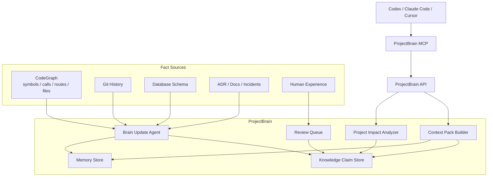
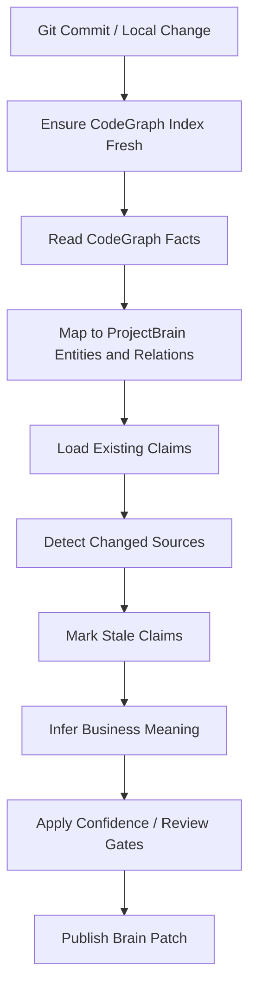

# CodeGraph Integration

| Field | Value |
| --- | --- |
| Document | CodeGraph Integration |
| Project | ProjectBrain |
| Status | Draft |
| Last updated | 2026-06-12 |

## 1. 结论

ProjectBrain 不应该在 V0.1 重复实现一个低配 CodeGraph。

更合理的路线是：

> CodeGraph 作为 ProjectBrain V0.1 的代码事实来源，ProjectBrain 专注长期项目记忆、业务理解、经验治理、知识生命周期和 Agent Context Pack。

二者关系：

```text
CodeGraph = Code Structure Intelligence
ProjectBrain = Project Cognition and Memory Governance
```

中文表达：

```text
CodeGraph 解决“代码在哪里、怎么连、谁调用谁”。
ProjectBrain 解决“这些代码在业务和项目历史中意味着什么、哪些知识需要长期记住、哪些变更会让旧认知过期”。
```

## 2. CodeGraph 能力定位

CodeGraph 已经很好地解决了代码结构层的问题：

- 本地代码索引。
- Tree-sitter 多语言解析。
- symbol、function、class、method、route 抽取。
- call graph、import、extends、implements 等关系。
- SQLite + FTS5 本地存储。
- MCP tools 给 Codex、Claude Code、Cursor 等 Agent 调用。
- 文件 watcher 和增量同步。
- callers/callees/impact/explore 等 Agent 友好的查询能力。

ProjectBrain 应该把这些结果作为 Fact Layer 的一部分，而不是重新造一套。

## 3. ProjectBrain 在 CodeGraph 之上补什么

| 能力 | CodeGraph | ProjectBrain |
| --- | --- | --- |
| Symbol 搜索 | 强 | 复用 |
| Call graph | 强 | 复用并扩展影响分析 |
| Route 到 handler | 有 | 映射为 API entity |
| 文件增量同步 | 有 | 复用 source freshness 信号 |
| 业务概念 | 非核心 | 核心 |
| 决策/事故/人工经验 | 非核心 | 核心 |
| Knowledge Claim | 无 | 核心 |
| Confidence / Review | 非核心 | 核心 |
| Knowledge lifecycle | 文件级 freshness | claim 级 lifecycle |
| stale knowledge | 索引过期提醒 | 语义知识过期检测 |
| Agent Context Pack | code context | project cognition context |

## 4. 新的 V0.1 架构



## 5. CodeGraph Adapter

### 5.1 目标

CodeGraph Adapter 把 CodeGraph 的代码结构事实导入 ProjectBrain。

职责：

- 读取 CodeGraph 项目状态。
- 拉取 files、symbols、edges、routes、impact results。
- 映射成 ProjectBrain 的 KnowledgeEntity、KnowledgeRelation、Source。
- 为后续 BusinessConcept、Decision、Constraint 关联提供代码锚点。

不负责：

- 业务概念推理。
- 人工经验审核。
- Knowledge lifecycle 决策。
- LLM reasoning。

### 5.2 集成方式

| 方式 | 优点 | 缺点 | 建议 |
| --- | --- | --- | --- |
| MCP 调用 CodeGraph tools | 不依赖内部 schema，Agent 生态一致 | 批量导入不方便 | V0.1 可用 |
| 调用 CodeGraph CLI | 简单，适合原型 | 输出格式受 CLI 限制 | V0.1 备选 |
| 读取 `.codegraph/codegraph.db` | 批量快，映射直接 | 依赖内部 schema | 本地实验可用 |
| Node sidecar 封装 CodeGraph API | 边界清晰，可稳定演进 | 多一个运行时 | V0.2 推荐 |

建议路线：

```text
V0.1:
  优先支持读取本地 .codegraph/codegraph.db
  同时保留 MCP/CLI adapter 接口

V0.2:
  增加 Node sidecar 或稳定 adapter

V1.0:
  FactSource Adapter 插件化，CodeGraph 只是其中一个实现
```

原因：

- 读取本地 DB 可以最快做出 ProjectBrain 的上层价值。
- 开源首版可以通过 synthetic demo 验证链路，不需要发布真实业务代码。
- 长期不能把 ProjectBrain 绑定死在 CodeGraph 内部 schema 上，所以 adapter 必须隔离。

## 6. Entity 映射

| CodeGraph | ProjectBrain |
| --- | --- |
| file | `Artifact` + `Source` |
| node kind `function` | `KnowledgeEntity(entity_type="Function")` |
| node kind `method` | `KnowledgeEntity(entity_type="Method")` |
| node kind `class` | `KnowledgeEntity(entity_type="Class")` |
| node kind `interface` | `KnowledgeEntity(entity_type="Interface")` |
| node kind `route` | `KnowledgeEntity(entity_type="API")` |
| node kind `component` | `KnowledgeEntity(entity_type="Component")` |
| node location | `Source(source_type="code_location")` |
| node signature | entity `properties.signature` |
| file path | entity/source locator |

示例：

```json
{
  "codegraph_node": {
    "kind": "method",
    "name": "RefundService.createRefund",
    "file": "payment-service/src/main/java/com/acme/payment/RefundService.java",
    "start_line": 42,
    "end_line": 88
  },
  "projectbrain_entity": {
    "entity_type": "Method",
    "stable_key": "codegraph:method:payment-service/src/main/java/com/acme/payment/RefundService.java:RefundService.createRefund",
    "name": "RefundService.createRefund",
    "properties": {
      "source": "codegraph",
      "file": "payment-service/src/main/java/com/acme/payment/RefundService.java"
    }
  }
}
```

## 7. Relation 映射

| CodeGraph Edge | ProjectBrain Relation |
| --- | --- |
| `calls` | `CALLS` |
| `imports` | `DEPENDS_ON` 或 `IMPORTS` |
| `extends` | `EXTENDS` |
| `implements` | `IMPLEMENTS_INTERFACE` |
| route handler relation | `HANDLED_BY` |
| contains relation | `CONTAINS` |

ProjectBrain 额外补充的关系：

| ProjectBrain Relation | 来源 |
| --- | --- |
| `IMPLEMENTS` | LLM + facts + docs |
| `PART_OF_FLOW` | LLM + graph path |
| `AFFECTS` | docs / incident / inference |
| `HAS_CONSTRAINT` | human / ADR / policy |
| `EVIDENCED_BY` | ProjectBrain source linker |
| `SUPERSEDES` | Brain Update Agent |

## 8. Source 映射

ProjectBrain 必须把 CodeGraph 节点映射成可追溯 source。

```json
{
  "source_type": "code_location",
  "uri": "codegraph://local/payment-platform/node/123",
  "locator": {
    "file": "payment-service/src/main/java/com/acme/payment/RefundService.java",
    "start_line": 42,
    "end_line": 88,
    "symbol": "RefundService.createRefund"
  },
  "content_hash": "..."
}
```

原则：

- CodeGraph 节点是事实来源。
- ProjectBrain 不直接把 CodeGraph 的上下文解释当作业务事实。
- 如果 CodeGraph source stale，则依赖它的 claim 也应进入 stale 检测。

## 9. Context Pack 如何使用 CodeGraph

### 9.1 原始任务

```text
给支付服务增加退款手续费
```

### 9.2 ProjectBrain 调用链

```text
ProjectBrain receives task
  ↓
CodeGraph Adapter finds relevant symbols/routes/files
  ↓
ProjectBrain loads related claims/constraints/decisions
  ↓
ProjectBrain builds task-specific context pack
```

### 9.3 Context Pack 内容

```json
{
  "summary": "This task likely touches refund creation, fee calculation, accounting records, and settlement.",
  "code_facts": [
    {
      "type": "method",
      "name": "RefundService.createRefund",
      "source": "codegraph"
    }
  ],
  "project_memory": [
    {
      "type": "constraint",
      "statement": "AccountRecord must not be physically deleted because it is used for financial audit.",
      "source": "projectbrain",
      "confidence": 1.0
    }
  ],
  "recommended_next_reads": [
    "RefundService.createRefund",
    "AccountRecordRepository.save"
  ]
}
```

## 10. Impact Analysis 如何使用 CodeGraph

CodeGraph 负责：

- changed symbol 的 callers。
- callees。
- code impact radius。
- related files。
- affected tests。

ProjectBrain 负责在其上补充：

- affected business concepts。
- affected database tables。
- affected APIs/topics。
- related incidents/decisions。
- human-confirmed constraints。
- stale knowledge。
- review recommendation。

### 输出分层

```json
{
  "codegraph_impact": {
    "changed_symbols": [],
    "callers": [],
    "callees": [],
    "affected_files": []
  },
  "projectbrain_impact": {
    "affected_business_concepts": [],
    "critical_constraints": [],
    "stale_claims": [],
    "review_recommendation": {}
  }
}
```

## 11. Brain Update Agent 中的 CodeGraph

Brain Update Agent 新流程：



关键点：

- CodeGraph 是 facts 的供应者。
- ProjectBrain 是 claims 和 lifecycle 的治理者。
- CodeGraph freshness 变化会触发 ProjectBrain stale detection。

## 12. 本地项目练手路线

任意本地项目都可以作为真实试点，但不要把真实代码、真实 CodeGraph DB、真实导出 facts 发布到公开仓库。

目标不是一开始全自动，而是跑通：

```text
CodeGraph 代码事实
  ↓
ProjectBrain 实体/关系导入
  ↓
人工补充项目领域经验
  ↓
生成 Context Pack
  ↓
做一次真实 Impact Analysis
```

### 12.1 需要从本地项目收集的信息

| 信息 | 用途 |
| --- | --- |
| 本地项目路径 | 找到 `.codegraph/codegraph.db` 或运行 CodeGraph |
| 主要语言/框架 | 判断是否需要 Java/Spring 专项映射 |
| 核心业务模块 | 初始化 BusinessConcept |
| 数据库 schema 或 migration | 建立 DataEntity |
| API 文档或路由 | 建立 InterfaceEntity |
| 你知道的“不能乱改”的经验 | 建立 Experience Layer |
| 一个真实变更任务 | 评估 Context Pack 和 Impact Analysis |

### 12.2 第一轮试点产物

```text
examples/payment-mini/
  projectbrain-codegraph-export.json
  experience-seed.md
```

### 12.3 试点验收标准

- 能从 CodeGraph 导入至少 100 个 code entities。
- 能把至少 3 条人工经验变成 `HUMAN_CONFIRMED` claims。
- 能为一个真实任务生成 context pack。
- 能识别至少 1 个高风险约束。
- 能输出一份 impact analysis。

## 13. 对现有文档的路线修正

原路线：

```text
V0.1 自建 Tree-sitter parser
```

修正后：

```text
V0.1 CodeGraph Adapter first
V0.2 Git/DB/API/Docs/Manual sources
V0.3 Java enterprise analyzers as supplement
```

这不是放弃 parser，而是调整优先级：

- CodeGraph 已经解决代码结构 facts。
- ProjectBrain 应先证明自己在长期记忆和知识治理上的价值。
- 自建 parser 作为 fallback 或企业定制增强，而不是第一优先级。

## 14. Open Questions

| Question | Decision Needed |
| --- | --- |
| V0.1 读取 `.codegraph/codegraph.db` 还是调用 MCP？ | 本地试点可先读 DB，长期加 adapter 抽象。 |
| 是否把 CodeGraph 作为必选依赖？ | V0.1 本地原型可以先依赖，开源 V1 应可插拔。 |
| CodeGraph schema 变化怎么办？ | Adapter 层隔离，增加兼容性测试。 |
| ProjectBrain 是否需要自己的 parser？ | 需要，但作为 fallback/补充，不作为 V0.1 主线。 |
| 如何处理 CodeGraph stale 状态？ | 映射到 ProjectBrain source freshness 和 stale claim detection。 |
