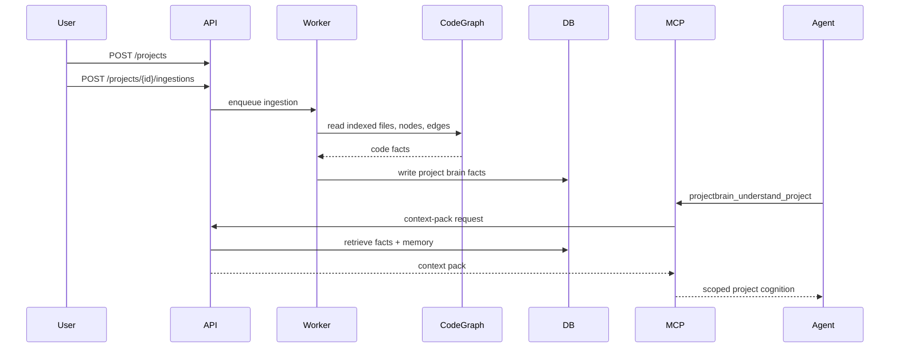

# ProjectBrain Delivery Gap Analysis

| Field | Value |
| --- | --- |
| Document | Delivery Gap Analysis |
| Project | ProjectBrain |
| Status | Draft |
| Last updated | 2026-06-12 |

## 1. 当前完成度总览

按你给出的路线：

```text
设计文档
  ↓
领域模型
  ↓
Knowledge Schema
  ↓
MVP 架构
  ↓
实现
```

当前状态是：

| 阶段 | 状态 | 已落地文档 | 还缺什么 |
| --- | --- | --- | --- |
| 设计文档 | 已完成第一版 | `design-document.md` | 需要后续 ADR 化关键决策 |
| 领域模型 | 已完成第一版 | `domain-model.md` | 需要用样例项目验证模型是否够用 |
| Knowledge Schema | 已完成第一版 | `knowledge-schema.md` | 需要真实 migration、OpenAPI schema、graph adapter 细化 |
| MVP 架构 | 已完成第一版 | `mvp-architecture.md` | 需要 repo scaffold、服务配置、部署文件 |
| 实现 | 未开始 | `implementation-plan.md` | 需要真正编码、测试、示例项目、CodeGraph Adapter 和 CI |

结论：

> 文档层面的架构闭环已经建立，但还没有进入实现阶段。下一步应从“文档设计”切换到“CodeGraph-backed 可运行 MVP 骨架”。

## 2. 设计文档还缺什么

已有：

- 产品定位。
- 核心价值。
- 总体架构。
- 三层知识体系。
- Brain Update Agent。
- Knowledge pollution 防护。
- Agent Skills。
- API 方向。
- MVP Roadmap。
- 开源规划。

还缺：

| 缺口 | 为什么需要 | 建议产物 |
| --- | --- | --- |
| ADR 列表 | 关键技术决策需要可追踪，避免未来反复讨论 | `docs/adr/0001-postgres-first.md` 等 |
| 非目标清单细化 | 避免 MVP 膨胀成大而全平台 | `docs/projectbrain/non-goals.md` |
| 权限和企业部署边界 | 企业环境一定会问代码隐私、token、权限 | `docs/projectbrain/security-model.md` |
| 成功指标和评估方法 | 判断 ProjectBrain 是否真的帮助 Agent | `docs/projectbrain/evaluation-plan.md` |

优先级：

1. ADR。
2. Evaluation Plan。
3. Security Model。
4. Non-goals。

## 3. 领域模型还缺什么

已有：

- Bounded Context。
- Project、SourceRoot、Artifact。
- CodeEntity、DataEntity、InterfaceEntity。
- BusinessConcept、BusinessFlow。
- Decision、Incident、Constraint。
- 企业 Java 微服务建模。

还缺：

| 缺口 | 为什么需要 | 建议产物 |
| --- | --- | --- |
| 端到端样例模型 | 需要验证模型能表达真实业务变化 | `examples/refund-handling-fee/domain-walkthrough.md` |
| 多仓库项目建模 | 企业项目常常不是单 repo | 扩展 ProjectGroup / ServiceGroup 模型 |
| Team Ownership 模型 | 影响 reviewer 推荐和风险治理 | OwnerTeam、CodeOwner、DomainOwner |
| Runtime/Deployment 模型 | 代码模块和线上服务不是一一对应 | DeploymentUnit、RuntimeService |
| 测试资产模型 | Impact Analysis 需要推荐测试 | TestCase、TestSuite、TestCoverageRelation |

最关键缺口：

> 需要一个真实样例贯穿“退款手续费 commit -> graph update -> stale knowledge -> impact analysis”。

## 4. Knowledge Schema 还缺什么

已有：

- PostgreSQL schema 草案。
- Source traceability。
- Confidence model。
- Knowledge lifecycle。
- Graph node/edge schema。
- Memory chunk schema。
- Knowledge pollution gate。
- Patch 模型。

还缺：

| 缺口 | 为什么需要 | 建议产物 |
| --- | --- | --- |
| Alembic migration | schema 需要变成可执行数据库结构 | `packages/schema/migrations/0001_initial.py` |
| Pydantic models | API 和 worker 需要共享类型 | `packages/schema/projectbrain_schema/*.py` |
| OpenAPI spec | API contract 需要机器可读 | `openapi/projectbrain-v1.yaml` |
| Graph adapter 抽象 | V0.1 Postgres-first，V1 可切 Neo4j/AGE | `GraphRepository` interface |
| Confidence policy config | 不同企业风险阈值不同 | `confidence_policy.yaml` |
| Lifecycle transition tests | 防止 claim 状态乱跳 | unit tests |
| Data retention policy | 私有代码和 prompt 摘要如何保存 | security model |

最关键缺口：

> 现在 schema 是设计稿，还没有变成 migration、model、repository 和测试。

## 5. MVP 架构还缺什么

已有：

- Docker Compose 服务边界。
- API、worker、MCP、CodeGraph Adapter、extractor 边界。
- V0.1/V0.2/V0.3/V1.0 能力边界。
- Frontend MVP 页面。
- 验收标准。

还缺：

| 缺口 | 为什么需要 | 建议产物 |
| --- | --- | --- |
| 实际 repo scaffold | 进入编码前必须有目录和基础工程 | `apps/`, `packages/`, `docker-compose.yml` |
| 本地 quickstart | 开源项目必须 15 分钟跑通 | `docs/getting-started.md` |
| 示例 repository | 没有样例无法验证 CodeGraph Adapter 和 ProjectBrain memory layer | `examples/payment-mini/` synthetic demo |
| Worker job contract | ingestion/update 是异步核心 | job payload schema |
| CodeGraph Adapter contract | V0.1 需要复用现有 CodeGraph 事实层 | adapter interface doc/code |
| Parser fallback contract | 后续补充 Java/Python/Go analyzer 需要插件化 | parser interface doc/code |
| MCP server stdio/http 选择 | 不同 Agent 集成方式不同 | ADR |

最关键缺口：

> 缺少一个最小可运行闭环：Create Project -> Read CodeGraph Index -> Import Entities/Relations -> Generate Context Pack -> MCP 调用。

## 6. 实现阶段还缺什么

实现目前未开始。需要从文档进入代码。

建议第一批实现文件：

```text
pyproject.toml
docker-compose.yml
apps/api/projectbrain_api/main.py
apps/api/projectbrain_api/routes/projects.py
apps/api/projectbrain_api/routes/ingestions.py
apps/api/projectbrain_api/routes/context_pack.py
apps/worker/projectbrain_worker/jobs/ingest_project.py
apps/mcp-server/projectbrain_mcp/server.py
packages/schema/projectbrain_schema/models.py
packages/schema/migrations/0001_initial.py
packages/adapters/projectbrain_adapters/codegraph.py
packages/extractors/projectbrain_extractors/codegraph/basic.py
```

第一条端到端实现链路：



## 7. 建议下一步顺序

### Step 1: 补最小实现骨架

目标：

- FastAPI 能启动。
- Postgres migration 能跑。
- Docker Compose 能拉起服务。

产物：

- `pyproject.toml`
- `docker-compose.yml`
- `apps/api`
- `packages/schema`
- health check API。

### Step 2: 实现 V0.1 ingest

目标：

- 能导入本地 repo。
- 能读取本地 CodeGraph index。
- 能生成 Artifact、Source、KnowledgeEntity、KnowledgeRelation。

产物：

- CodeGraph index discovery。
- CodeGraph node/edge mapper。
- entity extractor。
- ingestion worker。

### Step 3: 实现 Context Pack API

目标：

- Agent 能拿到项目摘要和相关 facts。

产物：

- `/context-pack` API。
- context retrieval service。
- MCP `understand_project`。

### Step 4: 做样例验证

目标：

- 用 Java refund demo 验证模型。

产物：

- sample Java Spring project。
- golden entities/relations。
- impact analysis 示例输出。

### Step 5: 实现 Brain Update Agent V0.2

目标：

- commit diff 触发更新。
- stale claim 可检测。

产物：

- git diff analyzer。
- update worker。
- stale detector。
- review queue。

## 8. 当前最应该补的文档

如果继续完善文档，而不是马上写代码，建议补这 5 份：

| 文档 | 价值 |
| --- | --- |
| `docs/projectbrain/evaluation-plan.md` | 定义如何证明 ProjectBrain 对 Agent 有用 |
| `docs/projectbrain/security-model.md` | 企业私有代码、LLM 输入、权限、审计 |
| `docs/projectbrain/codegraph-adapter-contract.md` | V0.1 CodeGraph Adapter 接口和兼容性策略 |
| `docs/projectbrain/parser-plugin-contract.md` | 后续 Java/Python/Go analyzer 插件接口 |
| `docs/projectbrain/refund-handling-fee-walkthrough.md` | 用一个真实业务变更贯穿全系统 |
| `docs/adr/0001-postgres-first-storage.md` | 记录为什么 MVP 先 Postgres-first |

## 9. 当前最应该写的代码

如果进入实现，建议不要先做 UI，也不要先做复杂 LLM Agent。

第一优先级：

1. schema migration。
2. project CRUD。
3. ingestion job。
4. CodeGraph Adapter。
5. CodeGraph entity/relation extractor。
6. context pack API。
7. MCP tool。

原因：

- 这条链路最短。
- 能证明 ProjectBrain 是 memory layer。
- 能尽早让 Coding Agent 实际调用。
- 后续 Java analyzer、Brain Update、Review UI 都能挂在这条链路上。
