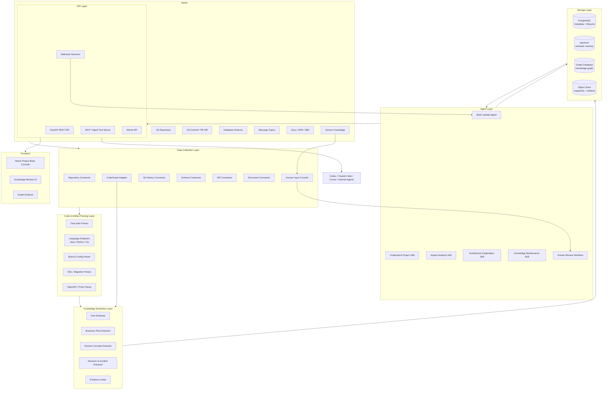
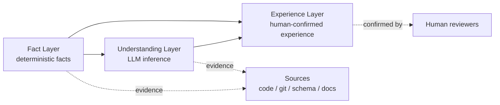
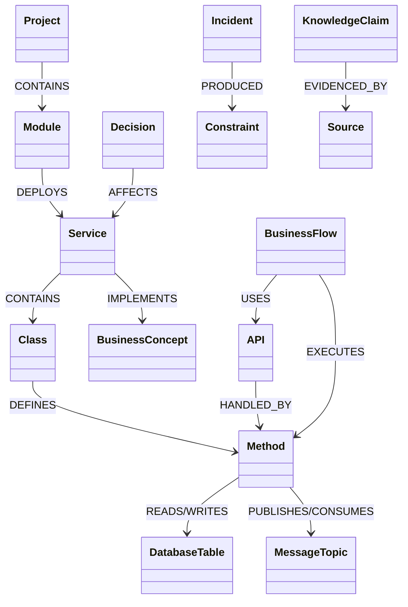
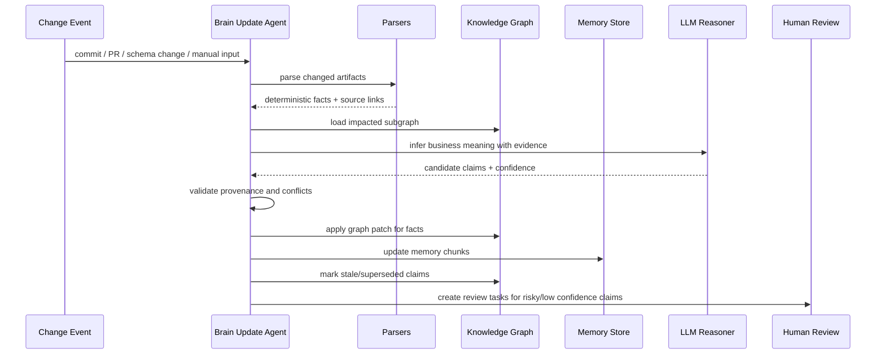
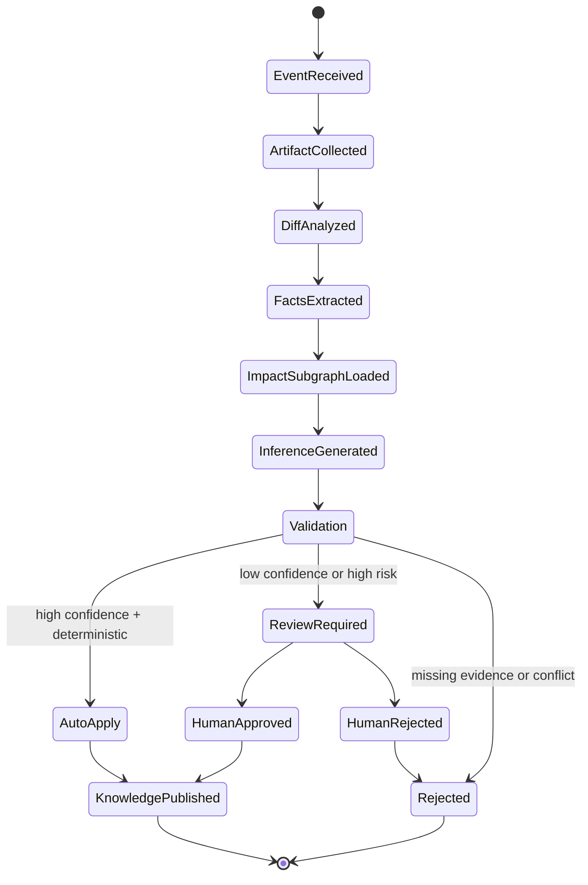
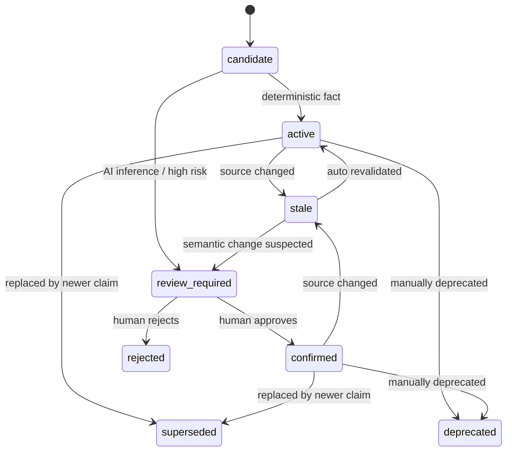
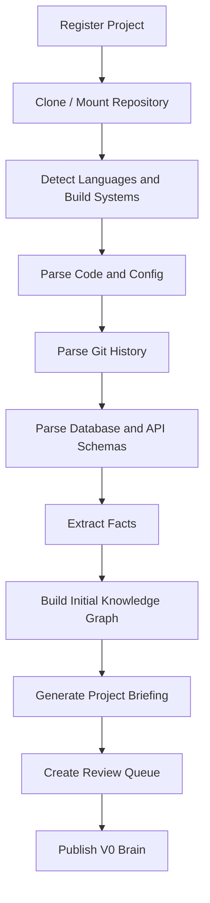
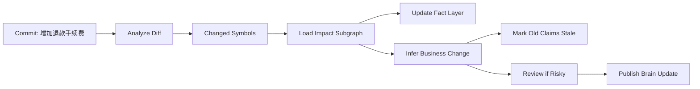

# ProjectBrain Design Document

| Field | Value |
| --- | --- |
| Project | ProjectBrain |
| Type | Open-source AI Software Engineer memory infrastructure |
| Status | Draft design |
| Primary audience | AI agent platform engineers, software architects, open-source contributors |
| Created | 2026-06-12 |
| Last updated | 2026-06-12 |

## 1. 项目背景

AI Coding Agent 已经能阅读代码、修改代码、运行测试、进行基础检索，并且在短任务中表现优秀。但在真实企业软件系统里，Agent 最大的问题不是“看不到代码”，而是“没有长期项目认知”。

大型项目里真正决定修改质量的信息通常不只在当前文件中：

- 某个服务为什么这样拆分。
- 某个表为什么不能物理删除。
- 某个接口虽然看似废弃，但仍被批处理或外部合作方调用。
- 某段代码背后有历史事故、合规约束或性能折中。
- 某个模块属于核心交易链路，改动需要额外审查。
- 某次 commit 修改的不只是代码行为，还改变了业务语义。

这些知识分散在 Git 历史、PR 讨论、架构文档、数据库设计、线上事故、老员工经验和代码结构中。现有代码搜索、CodeGraph、代码 wiki 和 RAG Code Search 能帮助 Agent 找到信息，但不能稳定维护一个项目级长期记忆系统。

ProjectBrain 要解决的是：让 AI Agent 像长期参与项目的资深工程师一样，持续理解、记忆、验证并演进一个软件系统。

## 2. 产品定位

ProjectBrain 的定位是：

> AI Software Engineer Memory Layer

它不是：

- 代码全文搜索工具。
- 单次代码库总结工具。
- 自动生成 Markdown 文档的脚本。
- 只回答“某个函数在哪里”的 RAG 系统。
- 替代 CodeGraph 的静态调用关系工具。

它是：

- 面向 AI Agent 的长期项目认知基础设施。
- 将事实、理解、经验分层存储的 Project Brain。
- 随代码和业务持续演进的知识系统。
- 给 Codex、Claude Code、Cursor、内部 Agent 提供上下文、约束、影响分析和维护能力的 Memory API。

## 3. 核心价值

ProjectBrain 的核心价值是降低 AI Agent 在大型工程中的认知冷启动成本和错误修改风险。

| 价值 | 说明 |
| --- | --- |
| 降低新人效应 | Agent 进入项目时可直接获得项目地图、核心领域、关键流程、风险模块和历史决策。 |
| 保护隐性知识 | 将“不要改这里”“为什么这样设计”“之前踩过什么坑”结构化为可追溯经验。 |
| 提升影响分析质量 | 从代码调用、数据读写、API、消息主题、业务概念多维度分析变更影响。 |
| 避免过期文档 | 通过 commit、PR、schema diff 和人工输入触发知识更新和过期标记。 |
| 支持 Agent 协作 | 为不同 coding agent 提供统一 Memory API、Skill API 和上下文包。 |
| 企业可治理 | 每条知识有来源、置信度、生命周期、审核状态和过期检测。 |

## 4. 总体架构设计

### 4.1 架构目标

ProjectBrain 需要同时满足三类能力：

1. **自动理解项目**：从 Git Repository、代码、配置、数据库 Schema、API、消息定义和人工输入中抽取结构化事实。
2. **持续维护知识**：代码变化时自动分析 diff、识别影响、更新 Knowledge Graph、标记旧知识过期。
3. **服务 AI Agent**：通过 Skills 和 API 为 Agent 提供理解项目、影响分析、架构解释、知识维护等能力。

### 4.1.1 与 CodeGraph 的关系

ProjectBrain 不与 CodeGraph 竞争，也不应在 V0.1 重复实现一个低配 CodeGraph。ProjectBrain 应优先把 CodeGraph 作为代码结构事实来源。

CodeGraph 负责：

- symbol、function、class、method、route 识别。
- call graph、imports、extends、implements 等代码结构关系。
- MCP 代码结构查询。
- 本地代码索引和增量同步。

ProjectBrain 负责：

- BusinessConcept、BusinessFlow、Decision、Incident、Constraint。
- KnowledgeClaim、confidence、source traceability、review state。
- claim 级 knowledge lifecycle。
- stale knowledge detection。
- Brain Update Agent。
- 面向 Codex、Claude Code、Cursor 的 task-specific context pack。

关系定义：

```text
CodeGraph = Code Structure Intelligence
ProjectBrain = Project Cognition and Memory Governance
```

### 4.2 总体架构图



### 4.3 分层职责

| 层 | 职责 | 关键输出 |
| --- | --- | --- |
| 数据采集层 | 连接 Git、数据库、API、文档、人工输入 | 原始 artifacts、变更事件、source records |
| 代码解析层 | 解析 AST、符号、调用、依赖、配置、schema | deterministic facts |
| 知识抽取层 | 从事实和文本中抽取领域概念、流程、决策、经验 | knowledge candidates |
| Graph Storage | 存储实体、关系、版本、证据链 | project knowledge graph |
| Memory Storage | 存储语义片段、解释、经验、上下文包 | retrievable memory |
| Agent Layer | 自动维护、影响分析、解释、审核协调 | agent skills and workflows |
| API Layer | 面向外部 Agent、UI、CI/CD 提供服务 | REST、MCP tools、webhook |

## 5. 数据模型设计

ProjectBrain 的数据模型围绕“知识不是单一文本，而是带证据、置信度和生命周期的实体关系”展开。

### 5.1 三层知识体系



#### Fact Layer

事实层由确定性解析器或可验证数据源产生。

示例：

- `PaymentService` 调用了 `AccountService`.
- `refund_order` API 写入 `refund_record` 表。
- `OrderCreatedEvent` 被 `SettlementConsumer` 消费。
- commit `abc123` 修改了 `RefundFeeCalculator`.

事实层原则：

- 不允许没有来源的事实。
- 默认 `confidence=1.0`.
- 可由 parser、schema reader、Git analyzer 重放生成。
- 事实被删除时不物理删除，进入 `superseded` 或 `stale` 状态。

#### Understanding Layer

理解层由 LLM 基于事实和证据推理生成。

示例：

- `PaymentService` 属于交易领域。
- `refund_fee` 是退款手续费业务概念。
- `Payment -> Accounting -> Settlement` 构成资金流核心链路。

理解层原则：

- 默认不能覆盖事实层。
- 必须记录推理来源和 prompt/run id。
- 默认 `confidence=0.4-0.8`.
- 高风险知识必须经过人工确认才能用于阻断性建议。

#### Experience Layer

经验层来自人工确认、事故复盘、ADR、代码评审结论。

示例：

- `AccountRecord` 不允许物理删除，因为涉及财务审计。
- `SettlementJob` 在月末流量高峰不能改调度窗口。
- 修改 `PaymentCallbackController` 必须兼容旧渠道签名。

经验层原则：

- 默认 `confidence=1.0`，但需要 reviewer 和来源。
- 可以约束 Agent 行为。
- 需要生命周期管理：生效、过期、替代、废弃。

### 5.2 核心实体

| 实体 | 说明 |
| --- | --- |
| Project | 一个 Git repository 或 monorepo 工作区。 |
| Module | Maven module、Gradle subproject、Python package、Go module 等。 |
| Service | 业务服务、微服务、应用入口或部署单元。 |
| Class | Java class、Python class、Go struct 等。 |
| Method | 可调用函数、方法、handler、job entrypoint。 |
| DatabaseTable | 数据库表、视图或物化视图。 |
| API | HTTP/RPC/GraphQL endpoint。 |
| MessageTopic | Kafka/RocketMQ/RabbitMQ topic 或 event type。 |
| BusinessConcept | 领域概念，例如订单、支付、退款、手续费。 |
| BusinessFlow | 业务流程，例如退款流程、支付回调流程。 |
| Decision | 架构决策、ADR、技术折中。 |
| Incident | 事故、线上问题、复盘事项。 |
| Constraint | 约束、禁忌、合规要求、性能红线。 |
| KnowledgeClaim | 一条可追踪、可审核、可过期的知识断言。 |
| Source | 代码位置、commit、PR、文档、人工输入等证据源。 |

### 5.3 知识断言模型

所有可被 Agent 消费的知识都应建模为 `KnowledgeClaim`。

```json
{
  "id": "kc_01J...",
  "project_id": "proj_payment",
  "claim_type": "AI_INFERENCE",
  "subject_id": "svc_payment",
  "predicate": "BELONGS_TO_DOMAIN",
  "object_id": "bc_transaction",
  "statement": "PaymentService belongs to the transaction domain.",
  "confidence": 0.72,
  "status": "active",
  "review_state": "pending",
  "valid_from": "2026-06-12T10:00:00Z",
  "valid_to": null,
  "sources": ["src_...", "commit_..."],
  "created_by": "brain-update-agent",
  "updated_by": "brain-update-agent"
}
```

## 6. Knowledge Graph 设计

### 6.1 节点类型



### 6.2 关系类型

| 关系 | 起点 | 终点 | 来源 |
| --- | --- | --- | --- |
| `CALL` | Method | Method | AST、bytecode、language analyzer |
| `DEPEND` | Module/Service/Class | Module/Service/Class | build config、imports、deployment config |
| `READ` | Method/Service | DatabaseTable | SQL parser、ORM mapping、repository method |
| `WRITE` | Method/Service | DatabaseTable | SQL parser、ORM mapping、repository method |
| `IMPLEMENT` | Service/Class/Method | BusinessConcept | LLM inference + review |
| `BELONG_TO` | Entity | Project/Module/Service/Domain | parser、repo layout、LLM |
| `HANDLED_BY` | API | Method | route parser、framework analyzer |
| `PUBLISH` | Method/Service | MessageTopic | MQ client analyzer |
| `CONSUME` | Method/Service | MessageTopic | consumer config analyzer |
| `AFFECT` | Decision/Incident/Constraint | Entity | docs、manual input、LLM extraction |
| `CAUSED_BY` | Incident | Entity/Decision/Commit | incident doc、manual input |
| `SOLVED_BY` | Incident | Decision/Commit/Constraint | incident doc、manual input |
| `SUPERSEDES` | KnowledgeClaim | KnowledgeClaim | update agent |
| `EVIDENCED_BY` | KnowledgeClaim | Source | extractor |

### 6.3 图查询示例

影响分析查询：

```cypher
MATCH path = (m:Method {name: "RefundFeeCalculator.calculate"})-[:CALL|WRITE|PUBLISH|HANDLED_BY*1..4]-(n)
RETURN path
```

核心领域查询：

```cypher
MATCH (bc:BusinessConcept {name: "Refund"})<-[:IMPLEMENT]-(entity)
OPTIONAL MATCH (entity)-[:AFFECT]-(risk:Constraint)
RETURN bc, entity, risk
```

旧知识过期检测：

```cypher
MATCH (claim:KnowledgeClaim)-[:EVIDENCED_BY]->(source:Source)
WHERE source.status = "deleted" OR source.version < claim.expected_source_version
RETURN claim
```

## 7. Agent 设计

### 7.1 Agent 类型

| Agent / Skill | 目标 | 输入 | 输出 |
| --- | --- | --- | --- |
| Brain Update Agent | 持续维护 Project Brain | commit、PR、schema diff、manual note | graph patch、memory patch、review tasks |
| Understand Project Skill | 帮助 Agent 快速理解项目 | project id、scope、role | project briefing、module map、risk notes |
| Impact Analysis Skill | 分析代码或需求修改影响 | diff、files、symbol、requirement | affected modules、flows、tables、constraints |
| Architecture Explanation Skill | 解释系统设计和历史原因 | question、scope | cited explanation、related decisions |
| Knowledge Maintenance Skill | 清理、审核、更新知识 | stale claims、human notes | merged claims、deprecated claims、review queue |

### 7.2 Brain Update Agent 流程



### 7.3 Brain Update Agent 状态机



### 7.4 Agent 上下文包

外部 Coding Agent 不应直接拿全量图数据，而应请求 task-specific context pack。

```json
{
  "task": "Add refund handling fee",
  "scope": {
    "files": ["payment-service/src/main/java/.../RefundService.java"],
    "symbols": ["RefundService.createRefund"]
  },
  "context_pack": {
    "project_summary": "...",
    "affected_modules": ["payment-service", "accounting-service"],
    "business_concepts": ["Refund", "HandlingFee", "AccountingRecord"],
    "critical_constraints": [
      {
        "statement": "AccountRecord must not be physically deleted because it is used for financial audit.",
        "confidence": 1.0,
        "source": "ADR-0042"
      }
    ],
    "related_flows": ["RefundFlow", "SettlementFlow"],
    "recommended_checks": ["run payment service tests", "check accounting reconciliation"]
  }
}
```

## 8. Memory 生命周期设计

### 8.1 生命周期状态

| 状态 | 含义 |
| --- | --- |
| `candidate` | 新抽取但未发布。 |
| `active` | 当前可被 Agent 使用。 |
| `review_required` | 需要人工确认。 |
| `confirmed` | 已人工确认。 |
| `stale` | 来源发生变化，可能过期。 |
| `superseded` | 被新知识替代。 |
| `deprecated` | 不再推荐使用，但保留历史。 |
| `rejected` | 审核拒绝或缺乏证据。 |

### 8.2 生命周期图



## 9. 核心流程设计

### 9.1 初次项目导入



初次导入输出：

- 项目地图。
- 模块依赖图。
- 服务列表和入口。
- 关键 API、表、消息主题。
- Top business concepts。
- 初始风险模块。
- 需要人工确认的问题清单。

### 9.2 Commit 更新流程

示例 commit：`增加退款手续费`

处理步骤：

1. Webhook 收到 commit event。
2. Git Connector 拉取 commit diff、changed files、commit message、author、parent。
3. Parser 解析变更文件，定位新增/修改/删除的 symbol、API、SQL、配置。
4. Graph 查询受影响子图，例如 `RefundService -> AccountService -> AccountRecord -> SettlementJob`。
5. LLM Reasoner 基于 diff 和子图推理业务变化：新增退款手续费概念，退款流程新增费用计算和记账影响。
6. Fact Extractor 写入确定性变化，例如新增方法、调用、表字段。
7. Understanding Layer 生成 candidate claims，例如 `RefundHandlingFee` 属于退款领域。
8. Stale Detector 标记旧知识，例如“退款金额等于订单金额”可能过期。
9. Risk Policy 判断是否需要人工审核。如果涉及财务、账务、合规，创建 review task。
10. 发布 graph patch 和 memory patch。



### 9.3 PR 辅助流程

PR 中 ProjectBrain 可提供：

- 变更涉及哪些业务概念。
- 是否碰到高风险约束。
- 哪些历史事故或 ADR 与本次改动相关。
- 推荐 reviewer。
- 推荐测试范围。
- 本次 PR 合并后需要更新哪些知识。

### 9.4 人工知识录入流程

人工输入不应直接进入高置信知识库，而是作为 source + claim：

1. 用户输入经验，例如“AccountRecord 不允许物理删除，因为涉及财务审计”。
2. 系统要求选择关联实体和来源类型：ADR、review comment、incident、manual note。
3. 创建 `KnowledgeClaim`，类型为 `HUMAN_CONFIRMED` 或 `HUMAN_NOTE_PENDING_LINK`。
4. 如果未关联实体，进入 linking queue。
5. 一旦关联成功，可被 Impact Analysis Skill 使用。

## 10. API 设计

### 10.1 REST API

| API | Method | 说明 |
| --- | --- | --- |
| `/api/v1/projects` | POST | 注册项目。 |
| `/api/v1/projects/{project_id}` | GET | 获取项目元数据。 |
| `/api/v1/projects/{project_id}/ingestions` | POST | 创建初次导入任务。 |
| `/api/v1/projects/{project_id}/events/git` | POST | 接收 Git webhook。 |
| `/api/v1/projects/{project_id}/context-pack` | POST | 为 Agent 生成任务上下文包。 |
| `/api/v1/projects/{project_id}/impact-analysis` | POST | 分析 diff、file、symbol 或需求影响。 |
| `/api/v1/projects/{project_id}/knowledge/query` | POST | 查询知识图谱和记忆。 |
| `/api/v1/projects/{project_id}/claims` | POST | 创建人工知识断言。 |
| `/api/v1/projects/{project_id}/claims/{claim_id}` | PATCH | 审核、确认、废弃知识。 |
| `/api/v1/projects/{project_id}/review-tasks` | GET | 获取待审核知识。 |

### 10.2 Context Pack API

Request:

```json
{
  "task": "Add refund handling fee",
  "files": ["payment-service/src/main/java/com/acme/payment/RefundService.java"],
  "symbols": ["RefundService.createRefund"],
  "max_tokens": 8000,
  "include": ["facts", "constraints", "flows", "decisions", "tests"]
}
```

Response:

```json
{
  "project_id": "proj_acme_payment",
  "context_pack_id": "ctx_01J...",
  "summary": "The change touches refund creation and accounting recording.",
  "facts": [],
  "constraints": [],
  "related_business_flows": [],
  "related_decisions": [],
  "recommended_files": [],
  "recommended_tests": [],
  "confidence": 0.84,
  "sources": []
}
```

### 10.3 MCP / Agent Tool 设计

面向 Codex、Claude Code、Cursor 的 MCP tools：

| Tool | 参数 | 返回 |
| --- | --- | --- |
| `projectbrain_understand_project` | `project_id`, `scope` | 项目 briefing |
| `projectbrain_get_context_pack` | `project_id`, `task`, `files`, `symbols` | task context |
| `projectbrain_analyze_impact` | `project_id`, `diff` 或 `symbols` | 影响分析 |
| `projectbrain_explain_architecture` | `project_id`, `question` | 带引用解释 |
| `projectbrain_submit_memory` | `project_id`, `statement`, `sources` | 创建人工知识 |
| `projectbrain_update_from_commit` | `project_id`, `commit_sha` | 更新任务状态 |

## 11. 技术选型

| 层 | V0.x 推荐 | V1.0 可选演进 | 理由 |
| --- | --- | --- | --- |
| Backend | Python + FastAPI | 拆分 worker service | Python 生态适合 parser、LLM、agent orchestration。 |
| Agent | LangGraph | OpenAI Agents SDK 或双适配 | LangGraph 适合显式状态机，OpenAI Agents SDK 适合工具生态。 |
| Code Facts | CodeGraph Adapter | Tree-sitter / JavaParser / JDT fallback | V0.1 不重复造 CodeGraph，先复用本地代码结构图。 |
| DB | PostgreSQL | PostgreSQL HA | 存储项目、实体、claim、source、任务状态。 |
| Vector | pgvector | Qdrant/Milvus | MVP 简化部署；后续按规模替换。 |
| Graph | Apache AGE 或 Neo4j | Neo4j/TigerGraph | MVP 可 Postgres-first，复杂图查询可独立图数据库。 |
| Queue | Postgres queue / Redis Queue | Kafka / Temporal | MVP 降低运维成本，V1 引入可靠工作流。 |
| Frontend | React | React + graph visualization | 审核和图谱浏览是核心 UI。 |
| Deployment | Docker Compose | Kubernetes / Helm | 开源项目先保证本地可跑。 |

## 12. MVP Roadmap

### V0.1: CodeGraph-backed Repository Brain Seed

目标：基于现有 CodeGraph 索引，对单个 repository 生成可查询的初始 Project Brain。

功能：

- 注册项目。
- 从 CodeGraph 导入文件、symbol、route、call edge、import edge。
- 映射为 ProjectBrain `KnowledgeEntity`、`KnowledgeRelation`、`Source`。
- 生成项目地图和模块摘要。
- 提供 Context Pack API。
- 支持人工补充 Experience Layer。

技术方案：

- FastAPI monolith。
- PostgreSQL + pgvector。
- CodeGraph Adapter。
- LangGraph initial summarizer。
- React 简单项目浏览页。

输入输出：

- 输入：本地 repository path + CodeGraph index。
- 输出：项目地图、实体图、初始 context pack。

### V0.2: Change-Aware Brain Update

目标：支持 commit/PR diff 驱动的知识更新。

功能：

- Git commit diff analyzer。
- 变更 symbol 定位。
- 受影响子图查询。
- stale knowledge 标记。
- Brain Update Agent 基础流程。

技术方案：

- Webhook receiver。
- Background worker。
- graph patch / memory patch 表。
- review task 表。

输入输出：

- 输入：commit sha、PR diff。
- 输出：impact summary、graph patch、stale claims。

### V0.3: Enterprise Java Microservice Support

目标：面向大型 Java 微服务项目增强准确性。

功能：

- Maven/Gradle module analyzer。
- Spring Controller、Service、Repository、Scheduled Job 识别。
- MyBatis/JPA SQL 与表关系抽取。
- OpenAPI endpoint 导入。
- Kafka/RocketMQ topic 基础识别。

技术方案：

- Tree-sitter + Java-specific analyzer。
- Spring annotation analyzer。
- SQL parser。
- 可插拔 extractor framework。

输入输出：

- 输入：多模块 Java repo、DDL、OpenAPI。
- 输出：服务地图、API 到方法映射、表读写关系、消息主题关系。

### V1.0: ProjectBrain for Coding Agents

目标：形成可开源发布的 AI Software Engineer Memory Layer。

功能：

- MCP server。
- 四类 Agent Skills。
- Human review UI。
- Knowledge confidence and lifecycle。
- 审计日志和多项目支持。
- Docker Compose 一键部署。

技术方案：

- FastAPI + worker + React。
- PostgreSQL + pgvector + graph storage。
- LangGraph/OpenAI Agents SDK adapter。
- GitHub/GitLab webhook。

输入输出：

- 输入：repo、Git events、schema、API、manual notes。
- 输出：Agent context、impact analysis、architecture explanation、maintained Project Brain。

## 13. 开源项目规划

### 13.1 Repository 结构

```text
projectbrain/
  apps/
    api/
    worker/
    web/
    mcp-server/
  packages/
    parsers/
    extractors/
    schema/
    agent-skills/
  docs/
    projectbrain/
    adr/
    examples/
  examples/
    java-spring-microservices/
    python-fastapi/
  docker-compose.yml
  README.md
```

### 13.2 开源边界

首个开源版本应坚持可落地：

- 支持本地 repository，不强依赖云服务。
- Docker Compose 可启动。
- 默认使用 Postgres + pgvector，避免复杂运维。
- 提供 sample repository 和 golden output。
- 提供 MCP server，让用户能从 Coding Agent 实际调用。

### 13.3 社区插件方向

- Java Spring Boot analyzer。
- MyBatis/JPA analyzer。
- Go analyzer。
- Python FastAPI/Django analyzer。
- GitHub/GitLab connector。
- Jira/Linear connector。
- ADR/doc extractor。
- Enterprise policy plugin，例如金融审计约束。

### 13.4 成功指标

| 指标 | V0.1 | V1.0 |
| --- | --- | --- |
| 初次导入时间 | 中型 repo 10 分钟内 | 大型 repo 30 分钟内增量完成 |
| 事实可追溯率 | 100% | 100% |
| AI 推理默认审核 | 支持 pending | 支持策略化审核 |
| Agent context usefulness | 人工评估 | PR 任务成功率提升 |
| 知识过期检测 | 基础 stale | commit/PR/schema 多源检测 |
