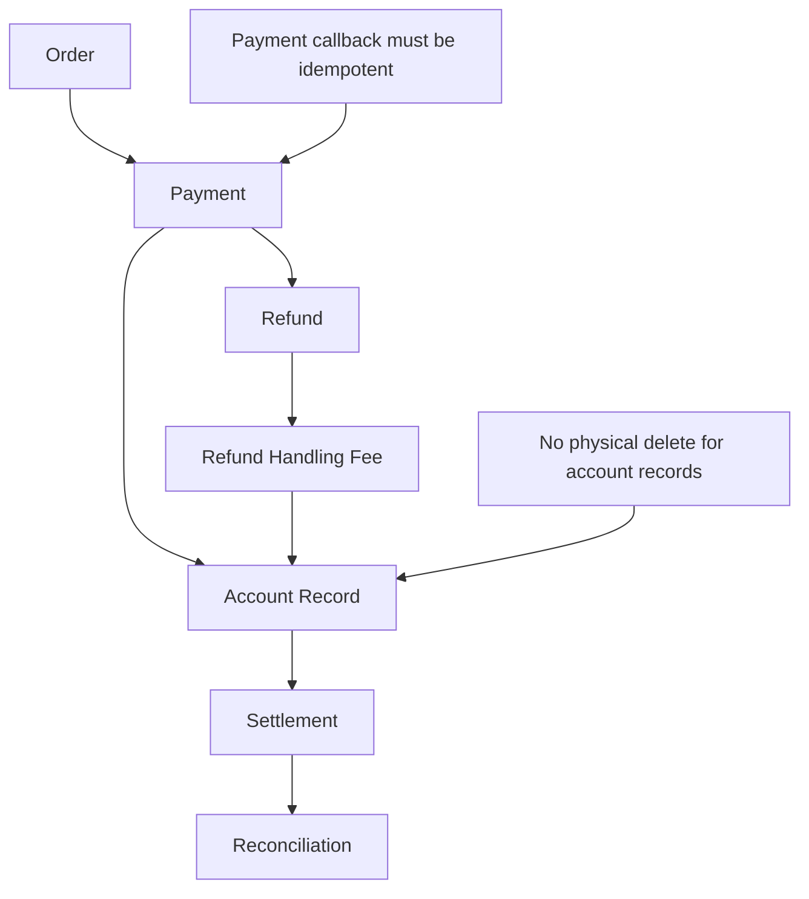

# ProjectBrain Domain Model

| Field | Value |
| --- | --- |
| Document | Domain Model |
| Project | ProjectBrain |
| Status | Draft |
| Last updated | 2026-06-12 |

## 1. 领域概览

ProjectBrain 的领域不是“代码检索”，而是“项目认知与记忆维护”。它把大型软件项目中的事实、理解、经验和历史变化建模为可追溯、可审核、可更新的长期知识。

核心领域问题：

- 如何从代码、Git、数据库、API、文档中抽取可靠事实。
- 如何把事实组织成 AI Agent 可消费的项目认知。
- 如何在代码变化后持续更新项目知识。
- 如何防止 LLM 推理污染长期记忆。
- 如何让人类经验成为 Agent 执行任务时的硬约束和软指导。

## 2. Bounded Context

```mermaid
flowchart LR
    subgraph Ingestion["Ingestion Context"]
        ProjectRegistration["Project Registration"]
        SourceCollection["Source Collection"]
        ChangeEvent["Change Event"]
    end

    subgraph Parsing["Parsing Context"]
        Artifact["Artifact"]
        Symbol["Symbol"]
        Dependency["Dependency"]
        SchemaObject["Schema Object"]
    end

    subgraph Knowledge["Knowledge Context"]
        Entity["Knowledge Entity"]
        Relation["Knowledge Relation"]
        Claim["Knowledge Claim"]
        Source["Evidence Source"]
    end

    subgraph Memory["Memory Context"]
        MemoryChunk["Memory Chunk"]
        ContextPack["Context Pack"]
        RetrievalPolicy["Retrieval Policy"]
    end

    subgraph Agent["Agent Context"]
        Skill["Agent Skill"]
        BrainRun["Brain Run"]
        ReviewTask["Review Task"]
    end

    Ingestion --> Parsing
    Parsing --> Knowledge
    Knowledge --> Memory
    Knowledge --> Agent
    Memory --> Agent
```



| Bounded Context | 责任 | 不负责 |
| --- | --- | --- |
| Ingestion | 项目注册、连接数据源、接收变更事件、保存原始 artifact 元数据 | 解释业务含义 |
| Parsing | 抽取 AST、symbol、调用、依赖、DDL、API route | 生成高层领域判断 |
| Knowledge | 管理实体、关系、claim、source、confidence、lifecycle | 直接服务外部 Agent 的 token 预算 |
| Memory | 构造可检索语义片段、上下文包、embedding | 决定知识真假 |
| Agent | 编排更新、影响分析、项目理解、人工审核 | 持久化底层事实 |

## 3. 核心领域对象

### 3.1 Project

Project 表示一个被 ProjectBrain 管理的软件项目。它可以是单仓库、多模块仓库、monorepo 中的一个 workspace，也可以是多个微服务组成的 project group。

关键属性：

- `id`
- `name`
- `repository_url`
- `default_branch`
- `primary_languages`
- `build_systems`
- `business_domains`
- `created_at`
- `last_indexed_at`

业务规则：

- 一个 Project 可以有多个 SourceRoot。
- 一个 Project 可以关联多个数据库 schema、API spec 和文档源。
- Project 的每次导入或更新都会产生一个 BrainRun。

### 3.2 SourceRoot

SourceRoot 表示可采集的知识源。

类型：

- `git_repository`
- `database_schema`
- `openapi_spec`
- `protobuf_spec`
- `message_registry`
- `markdown_docs`
- `adr`
- `manual_note`
- `incident_report`

关键属性：

- `id`
- `project_id`
- `type`
- `uri`
- `auth_ref`
- `sync_policy`
- `last_synced_at`

### 3.3 Artifact

Artifact 是解析前或解析后的原始材料单位。

示例：

- 一个 Java 文件。
- 一个 Maven `pom.xml`。
- 一个 SQL migration 文件。
- 一个 OpenAPI YAML。
- 一个 ADR Markdown。
- 一个 commit diff。

关键属性：

- `id`
- `project_id`
- `source_root_id`
- `artifact_type`
- `path`
- `content_hash`
- `version_ref`
- `language`
- `status`

### 3.4 CodeEntity

CodeEntity 是代码世界中的结构化实体。

子类型：

- `Module`
- `Package`
- `Service`
- `Class`
- `Interface`
- `Method`
- `Function`
- `Field`
- `ConfigKey`
- `Job`
- `Repository`
- `Controller`

大型 Java 微服务项目中需要特别识别：

- Spring Boot application。
- Spring Controller。
- Spring Service。
- Spring Repository。
- Feign client。
- MyBatis mapper。
- JPA entity。
- Scheduled job。
- Kafka/RocketMQ consumer。
- Transaction boundary。

### 3.5 DataEntity

DataEntity 表示数据结构和持久化对象。

子类型：

- `Database`
- `Schema`
- `Table`
- `Column`
- `Index`
- `View`
- `Migration`
- `ORMEntity`

业务规则：

- 表和列是事实层对象，必须来自 DDL、数据库 introspection 或 migration。
- ORMEntity 与 Table 的映射可以来自注解、XML、配置或推理。
- 对账、审计、账务类表可以被人工标记为高风险。

### 3.6 InterfaceEntity

InterfaceEntity 表示系统边界。

子类型：

- `HttpAPI`
- `RpcMethod`
- `GraphQLOperation`
- `MessageTopic`
- `EventType`
- `Webhook`
- `BatchFile`

关键关系：

- API `HANDLED_BY` Method。
- Method `PUBLISHES` MessageTopic。
- Method `CONSUMES` MessageTopic。
- API `IMPLEMENTS` BusinessCapability。

### 3.7 BusinessConcept

BusinessConcept 是 ProjectBrain 区别于代码搜索工具的核心对象。它承载业务语义。

示例：

- Order
- Payment
- Refund
- Refund Handling Fee
- Account Record
- Settlement
- Reconciliation
- Invoice
- User Identity

关键属性：

- `name`
- `aliases`
- `description`
- `domain`
- `criticality`
- `owner_team`
- `review_required`

业务规则：

- BusinessConcept 可以由 LLM 发现，但默认需要证据和置信度。
- 与财务、合规、权限、隐私相关的概念应默认进入人工审核。
- BusinessConcept 与代码实体之间通过 `IMPLEMENTS`、`USES`、`CALCULATES`、`VALIDATES` 等关系连接。

### 3.8 BusinessFlow

BusinessFlow 表示跨模块、跨服务的业务流程。

示例：

- 支付创建流程。
- 支付回调流程。
- 退款流程。
- 退款手续费记账流程。
- 月末结算流程。
- 对账差异处理流程。

关键属性：

- `name`
- `description`
- `entrypoints`
- `steps`
- `critical_tables`
- `critical_topics`
- `known_risks`

流程步骤模型：

```json
{
  "flow": "RefundFlow",
  "steps": [
    {
      "order": 1,
      "actor": "RefundController",
      "action": "Receives refund request",
      "entities": ["RefundRequest", "Order"],
      "sources": ["src_..."]
    },
    {
      "order": 2,
      "actor": "RefundService",
      "action": "Calculates refundable amount and handling fee",
      "entities": ["Refund", "RefundHandlingFee"],
      "sources": ["src_..."]
    }
  ]
}
```

### 3.9 Decision

Decision 表示架构决策、技术折中和重要历史选择。

来源：

- ADR。
- PR discussion。
- issue。
- wiki。
- incident postmortem。
- manual input。

关键属性：

- `title`
- `context`
- `decision`
- `consequences`
- `status`
- `decided_at`
- `superseded_by`

### 3.10 Incident

Incident 表示线上事故或重要故障经验。

关键属性：

- `title`
- `severity`
- `happened_at`
- `summary`
- `root_cause`
- `affected_entities`
- `followup_constraints`

关键关系：

- `Incident CAUSED_BY Entity`
- `Incident SOLVED_BY Decision`
- `Incident PRODUCED Constraint`

### 3.11 Constraint

Constraint 是 Agent 执行任务时必须考虑的规则、禁忌和边界。

类型：

- `compliance`
- `security`
- `financial_audit`
- `performance`
- `compatibility`
- `operational`
- `domain_invariant`
- `team_policy`

示例：

- `AccountRecord` 不允许物理删除。
- 支付回调接口必须保持幂等。
- 账务流水金额必须以分为单位存储。
- 对外 API 的字段只能新增，不能破坏兼容。

## 4. 关系模型

### 4.1 代码事实关系

| 关系 | 说明 | 生成方式 |
| --- | --- | --- |
| `CONTAINS` | Project/Module/Class 包含下级实体 | parser |
| `DECLARES` | 文件声明类、函数、字段 | parser |
| `CALLS` | 方法调用方法 | AST/language analyzer |
| `IMPORTS` | 文件或类导入依赖 | parser |
| `EXTENDS` | 类继承 | parser |
| `IMPLEMENTS_INTERFACE` | 类实现接口 | parser |
| `ANNOTATED_WITH` | 注解关系 | parser |
| `CONFIGURES` | 配置影响服务或组件 | config parser |

### 4.2 数据关系

| 关系 | 说明 | 生成方式 |
| --- | --- | --- |
| `READS` | 方法或服务读取表 | SQL/ORM analyzer |
| `WRITES` | 方法或服务写表 | SQL/ORM analyzer |
| `MAPS_TO` | ORM entity 映射数据库表 | Java annotation/XML parser |
| `MIGRATES` | migration 修改表结构 | DDL parser |
| `REFERENCES` | 表外键或逻辑引用 | DDL + inference |

### 4.3 系统边界关系

| 关系 | 说明 | 生成方式 |
| --- | --- | --- |
| `HANDLED_BY` | API 由方法处理 | route analyzer |
| `CALLS_API` | 服务调用外部 API | HTTP client analyzer |
| `PUBLISHES` | 方法发布消息 | MQ analyzer |
| `CONSUMES` | 方法消费消息 | MQ analyzer |
| `SCHEDULED_BY` | Job 调度配置 | annotation/config parser |

### 4.4 业务认知关系

| 关系 | 说明 | 生成方式 |
| --- | --- | --- |
| `IMPLEMENTS` | 代码实体实现业务概念 | LLM + evidence |
| `PART_OF_FLOW` | 实体属于业务流程 | LLM + graph evidence |
| `PROTECTS` | Constraint 保护业务概念 | human/docs |
| `AFFECTS` | 决策或事故影响实体 | docs/manual |
| `CAUSED_BY` | 事故由某实体或决策导致 | postmortem/manual |
| `SOLVED_BY` | 事故由某修复或决策解决 | postmortem/manual |

## 5. Aggregate 设计

### 5.1 Project Aggregate

根实体：`Project`

包含：

- SourceRoot
- ProjectConfig
- IngestionPolicy
- LanguageProfile

不直接包含：

- 全量 KnowledgeEntity。
- 全量 MemoryChunk。

原因：大型企业项目实体量巨大，应通过 project_id 分区和索引关联，而不是作为内存聚合一次加载。

### 5.2 Knowledge Aggregate

根实体：`KnowledgeClaim`

包含：

- subject
- predicate
- object
- statement
- confidence
- lifecycle
- source links
- review state

业务规则：

- 没有 source 的 claim 不能进入 `active`。
- `AI_INFERENCE` 类型 claim 默认不能进入 `confirmed`。
- 高风险 entity 相关 claim 必须 review。
- claim 更新不覆盖历史，而是通过 `SUPERSEDES` 建立新版本。

### 5.3 BrainRun Aggregate

根实体：`BrainRun`

表示一次导入、更新、分析或维护任务。

类型：

- `initial_ingestion`
- `commit_update`
- `pr_analysis`
- `schema_update`
- `manual_knowledge_ingestion`
- `maintenance`

状态：

- `queued`
- `running`
- `waiting_review`
- `completed`
- `failed`
- `cancelled`

输出：

- fact patches
- graph patches
- memory patches
- stale claims
- review tasks
- run report

## 6. 企业 Java 微服务建模

ProjectBrain V0.3 之后应重点支持 Java 微服务。

### 6.1 Java 服务识别

识别来源：

- Maven/Gradle module。
- Spring Boot main class。
- `application.yml` 中的 service name。
- Dockerfile、Helm chart、deployment yaml。
- package naming convention。

实体映射：

| Java/Spring 构造 | ProjectBrain 实体 |
| --- | --- |
| Maven module | Module |
| Spring Boot application | Service |
| `@RestController` | Controller + API handler |
| `@Service` | ServiceComponent |
| `@Repository` | Repository |
| `@Mapper` | Mapper |
| `@Entity` | ORMEntity |
| `@Scheduled` | Job |
| `@KafkaListener` | MessageConsumer |
| Feign client | ExternalServiceClient |

### 6.2 典型交易系统领域模型



ProjectBrain 需要能回答：

- 修改退款手续费会影响哪些表？
- 哪些服务消费退款消息？
- 退款流程是否影响对账？
- 有哪些历史事故与退款、账务、结算相关？
- 是否存在“不能改”的人工经验？

## 7. Ubiquitous Language

| Term | Definition |
| --- | --- |
| Project Brain | 一个项目的长期认知与记忆集合。 |
| Fact | 可由确定性来源验证的事实。 |
| Understanding | 基于事实和上下文推理出的业务或架构理解。 |
| Experience | 人工确认或历史沉淀的经验、禁忌、约束。 |
| Claim | 可追溯、可审核、可过期的一条知识断言。 |
| Evidence | 支撑 claim 的来源，包括代码位置、commit、文档、人工记录。 |
| Context Pack | 为某次 Agent 任务定制的上下文包。 |
| BrainRun | 一次导入、更新、维护或分析任务的执行记录。 |
| Stale Knowledge | 来源变化后可能不再准确的知识。 |
| Knowledge Pollution | 未经验证的错误推理进入长期记忆。 |

