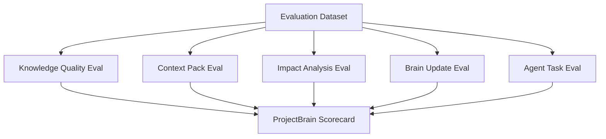
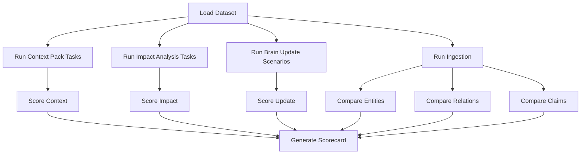

# ProjectBrain Evaluation Plan

| Field | Value |
| --- | --- |
| Document | Evaluation Plan |
| Project | ProjectBrain |
| Status | Draft |
| Last updated | 2026-06-12 |

## 1. 目标

ProjectBrain 的价值不能只靠“文档看起来完整”证明。它必须证明自己能让 AI Coding Agent 在真实工程任务中做得更好。

本文定义 ProjectBrain 的评估方法：

- 评估 Project Brain 的知识质量。
- 评估 Context Pack 对 Agent 的帮助。
- 评估 Impact Analysis 的准确性。
- 评估 Brain Update Agent 的维护效果。
- 评估 Knowledge Pollution 防护是否有效。

## 2. 核心评估问题

ProjectBrain 需要回答五个问题：

1. **Agent 是否更快理解项目？**
2. **Agent 是否更少漏掉关键影响？**
3. **Agent 是否更少违反历史约束和人工经验？**
4. **代码变化后 Project Brain 是否能及时更新？**
5. **LLM 幻觉是否被拦在长期记忆之外？**

## 3. Evaluation Layers



## 4. Evaluation Dataset

### 4.1 数据集类型

| Dataset | Purpose |
| --- | --- |
| `java-spring-refund-demo` | 验证企业 Java 微服务建模、退款手续费场景。 |
| `python-fastapi-basic` | 验证 Python API 项目基础理解。 |
| `go-service-basic` | 验证 Go 服务基础解析。 |
| `docs-adr-incident-demo` | 验证 ADR、incident、manual experience 抽取。 |
| `multi-service-payment-demo` | 验证跨服务影响分析。 |

### 4.2 每个数据集应包含

```text
dataset/
  repo/
  docs/
  git-history/
  expected/
    entities.json
    relations.json
    claims.json
    stale_claims.json
    review_tasks.json
    context_packs.json
    impact_analysis.json
  tasks/
    task_001_add_refund_fee.md
    task_002_modify_callback.md
```

### 4.3 Golden Truth

每个数据集需要人工维护 golden truth：

- 应识别哪些实体。
- 应识别哪些关系。
- 哪些 claim 是正确的。
- 哪些 claim 必须 stale。
- 哪些 review task 必须生成。
- Impact Analysis 至少应包含哪些受影响对象。

## 5. Knowledge Quality Evaluation

### 5.1 Entity Extraction Metrics

| Metric | Definition |
| --- | --- |
| Entity Precision | 抽取出的实体中有多少是正确实体。 |
| Entity Recall | golden truth 中有多少实体被抽取出来。 |
| Stable Key Accuracy | stable_key 是否稳定、唯一、可复现。 |
| Source Coverage | 有 source 的实体占比。 |

计算：

```text
entity_precision = correct_extracted_entities / extracted_entities
entity_recall = correct_extracted_entities / expected_entities
source_coverage = entities_with_source / extracted_entities
```

目标：

| Version | Entity Precision | Entity Recall | Source Coverage |
| --- | --- | --- | --- |
| V0.1 | >= 0.85 | >= 0.70 | 1.00 |
| V0.3 | >= 0.90 | >= 0.82 | 1.00 |
| V1.0 | >= 0.93 | >= 0.88 | 1.00 |

### 5.2 Relation Extraction Metrics

| Metric | Definition |
| --- | --- |
| Relation Precision | 抽取关系正确率。 |
| Relation Recall | golden relation 覆盖率。 |
| Direction Accuracy | 关系方向是否正确。 |
| Relation Source Coverage | 关系是否有证据来源。 |

按关系类型分别评估：

- `CONTAINS`
- `CALLS`
- `READS`
- `WRITES`
- `HANDLED_BY`
- `PUBLISHES`
- `CONSUMES`
- `IMPLEMENTS`
- `AFFECTS`

V0.1 可只评估：

- `CONTAINS`
- `DECLARES`
- `IMPORTS`
- `DEPENDS_ON`

V0.3 必须评估：

- `HANDLED_BY`
- `READS`
- `WRITES`
- Java Spring / MyBatis / JPA 相关关系。

### 5.3 Claim Quality Metrics

| Metric | Definition |
| --- | --- |
| Claim Precision | active/confirmed claim 中正确 claim 占比。 |
| Claim Source Coverage | claim 有 source 的比例。 |
| Inference Review Rate | AI inference 进入 review 的比例。 |
| High-risk Auto-publish Rate | 高风险 AI inference 自动发布比例，目标为 0。 |
| Conflict Detection Rate | 冲突 claim 被识别的比例。 |

硬性门槛：

```text
claim_source_coverage = 1.0
high_risk_auto_publish_rate = 0.0
```

## 6. Context Pack Evaluation

### 6.1 目标

Context Pack 的目标不是“返回最多内容”，而是在 token budget 内返回对任务最有用、最可信、最有风险意识的上下文。

### 6.2 Metrics

| Metric | Definition |
| --- | --- |
| Context Relevance | 返回内容与任务相关的比例。 |
| Critical Constraint Recall | 关键约束是否被返回。 |
| Source Citation Rate | 返回 item 中有 source 的比例。 |
| Stale Knowledge Exclusion | stale/rejected 知识是否被排除。 |
| Token Efficiency | 有用内容 tokens / 总 tokens。 |
| Omission Quality | 截断时是否说明遗漏内容。 |

### 6.3 评估方法

给定任务：

```text
Add refund handling fee to refund flow.
```

期望 Context Pack 至少包含：

- `RefundService`
- `RefundAmountCalculator`
- `refund_record`
- `account_record`
- `Refund` business concept
- `AccountRecord append-only` constraint
- 相关 settlement/reconciliation 风险提示
- 推荐测试

评分：

```text
critical_constraint_recall = returned_critical_constraints / expected_critical_constraints
context_relevance = relevant_items / returned_items
source_citation_rate = items_with_source / returned_items
```

目标：

| Version | Relevance | Critical Constraint Recall | Source Citation |
| --- | --- | --- | --- |
| V0.1 | >= 0.70 | >= 0.80 | >= 0.95 |
| V0.3 | >= 0.78 | >= 0.90 | >= 0.98 |
| V1.0 | >= 0.85 | >= 0.95 | 1.00 |

## 7. Impact Analysis Evaluation

### 7.1 Metrics

| Metric | Definition |
| --- | --- |
| Affected Entity Recall | 应被识别的受影响实体中被识别的比例。 |
| Affected Entity Precision | 返回的受影响实体中真实受影响的比例。 |
| Critical Risk Recall | 高风险约束和流程是否被识别。 |
| Test Recommendation Recall | 应推荐测试是否被推荐。 |
| Over-warning Rate | 无关风险提示比例。 |

### 7.2 按维度评估

Impact Analysis 必须分维度评估：

| Dimension | Examples |
| --- | --- |
| Code | class、method、module |
| Data | table、column、migration |
| API | route、RPC、webhook |
| Message | topic、event type、consumer |
| Business | business concept、business flow |
| Experience | constraint、incident、decision |
| Tests | test case、test suite |

### 7.3 退款手续费场景 expected impact

必须识别：

```json
{
  "affected_modules": [
    "payment-service",
    "accounting-service",
    "settlement-service",
    "reconciliation-service"
  ],
  "affected_tables": [
    "refund_record",
    "account_record"
  ],
  "affected_business_concepts": [
    "Refund",
    "Refund Handling Fee",
    "AccountRecord",
    "Settlement",
    "Reconciliation"
  ],
  "critical_constraints": [
    "AccountRecord append-only"
  ]
}
```

V0.1 可不要求跨服务完整召回。

V0.3 必须要求 Java 微服务场景下跨 API、service、repository、table 的基本召回。

## 8. Brain Update Evaluation

### 8.1 Metrics

| Metric | Definition |
| --- | --- |
| Update Latency | commit event 到 BrainRun 完成的时间。 |
| Fact Refresh Accuracy | 变化事实是否正确更新。 |
| Stale Claim Recall | 应 stale 的 claim 是否被标记。 |
| False Stale Rate | 不该 stale 的 claim 被错误标记比例。 |
| Review Task Precision | 创建的 review task 是否必要。 |
| Patch Auditability | graph/memory patch 是否可审计。 |

### 8.2 目标

| Version | Update Latency | Stale Claim Recall | False Stale Rate |
| --- | --- | --- | --- |
| V0.2 | < 5 min for medium repo | >= 0.70 | <= 0.25 |
| V0.3 | < 10 min for Java microservice repo | >= 0.80 | <= 0.20 |
| V1.0 | < 30 min for large enterprise repo | >= 0.88 | <= 0.15 |

## 9. Knowledge Pollution Evaluation

### 9.1 必测规则

| Rule | Expected |
| --- | --- |
| AI inference without source | rejected |
| High-risk AI inference | review_required |
| Human confirmed with source | confirmed |
| Claim whose source changed | stale |
| Rejected claim regenerated | blocked or flagged |
| Conflicting active claims | review_required |

### 9.2 Pollution Score

```text
pollution_escape_rate = polluted_claims_reaching_active / polluted_candidate_claims
```

目标：

```text
pollution_escape_rate = 0 for high-risk claims
pollution_escape_rate <= 0.05 for normal-risk claims
```

### 9.3 Test Cases

测试用例：

1. LLM 声称 `RefundService` 属于 settlement domain，但没有证据。
2. LLM 声称 `account_record` 可以物理删除。
3. LLM 从一个方法名推断整个服务职责。
4. 文档中旧 ADR 被新 ADR 替代。
5. 人工输入“这里不能删”，但未关联实体。

期望：

- 1 进入 rejected 或 review。
- 2 必须 review_required，不能 active。
- 3 降低 confidence。
- 4 旧 claim superseded。
- 5 进入 linking queue。

## 10. Agent Task Evaluation

### 10.1 目标

最终要评估的是 Agent 使用 ProjectBrain 后是否更会做工程任务。

### 10.2 对照实验

每个任务跑两组：

- Baseline：Agent 只用普通代码检索。
- ProjectBrain：Agent 先调用 context pack + impact analysis。

### 10.3 任务类型

| Task | Description |
| --- | --- |
| T1 | 增加退款手续费。 |
| T2 | 修改支付回调幂等逻辑。 |
| T3 | 给账务流水增加展示字段，但不能破坏审计约束。 |
| T4 | 修改结算任务调度。 |
| T5 | 删除一个看似无用的 API 字段，验证兼容性风险。 |

### 10.4 Metrics

| Metric | Definition |
| --- | --- |
| Task Success Rate | 任务是否正确完成。 |
| Constraint Violation Rate | 是否违反已知约束。 |
| Impact Coverage | Agent 方案是否覆盖关键影响点。 |
| Test Selection Quality | 推荐或运行的测试是否合理。 |
| Rework Rate | 需要人工返工的比例。 |
| Time to Useful Plan | Agent 生成可执行方案的时间。 |

### 10.5 Review Rubric

人工评审按 1-5 分：

| Dimension | 1 | 3 | 5 |
| --- | --- | --- | --- |
| Project understanding | 基本误解 | 理解局部模块 | 理解业务和架构上下文 |
| Impact awareness | 漏掉关键影响 | 覆盖主要代码影响 | 覆盖代码、数据、API、消息、业务 |
| Constraint awareness | 违反约束 | 提到部分约束 | 主动规避关键约束 |
| Implementation plan | 不可执行 | 基本可执行 | 风险、测试、回滚清晰 |
| Evidence use | 无引用 | 部分引用 | 关键判断都有来源 |

## 11. Evaluation Pipeline



Scorecard 示例：

```json
{
  "dataset": "java-spring-refund-demo",
  "version": "0.3.0",
  "entity_precision": 0.91,
  "entity_recall": 0.84,
  "relation_precision": 0.86,
  "relation_recall": 0.78,
  "context_relevance": 0.82,
  "critical_constraint_recall": 0.93,
  "impact_entity_recall": 0.81,
  "stale_claim_recall": 0.76,
  "pollution_escape_rate_high_risk": 0.0
}
```

## 12. Release Gates

### V0.1 Release Gate

必须满足：

- Entity source coverage = 1.0。
- Claim source coverage = 1.0。
- 能跑通至少一个 sample repo。
- Context Pack API 返回 source/confidence。
- No high-risk AI inference auto-published。

### V0.2 Release Gate

必须满足：

- commit update workflow 可跑通。
- stale claim recall >= 0.70。
- review task 可创建。
- impact analysis 可输出 affected entities。

### V0.3 Release Gate

必须满足：

- Java Spring refund demo 跑通。
- Spring Controller -> Service -> Repository -> Table 基本链路识别。
- refund handling fee walkthrough 的 expected outputs 通过。
- critical constraint recall >= 0.90。

### V1.0 Release Gate

必须满足：

- 至少三个 example datasets。
- MCP tools 可被真实 Coding Agent 调用。
- Agent task evaluation 显示相对 baseline 有明显提升。
- Knowledge pollution high-risk escape rate = 0。
- 文档、CI、Docker Compose、contributor guide 完整。

## 13. Evaluation Implementation Plan

### Phase 1: Golden Test Harness

实现：

- dataset loader。
- expected JSON comparator。
- score calculator。
- markdown/json scorecard output。

### Phase 2: Context and Impact Eval

实现：

- context pack task runner。
- impact analysis task runner。
- critical item matcher。
- token budget metrics。

### Phase 3: Agent Task Eval

实现：

- baseline runner。
- ProjectBrain runner。
- human review form。
- score aggregation。

### Phase 4: CI Integration

实现：

- PR 中跑小型 golden tests。
- nightly 跑完整 eval。
- release 前生成 scorecard。

## 14. Open Questions

| Question | Why it matters |
| --- | --- |
| Agent task success 是否用人工评审还是自动评审？ | 自动评审便宜但可能不可靠。 |
| 企业私有项目 golden truth 如何维护？ | 需要支持内部评估但不泄露代码。 |
| 多语言项目的 relation recall 如何公平评估？ | 不同语言静态分析难度不同。 |
| LLM 模型变化是否影响 evaluation 稳定性？ | 需要固定模型或记录模型版本。 |
| Context Pack token efficiency 如何自动判断？ | 需要 relevance label 或人工评审。 |

