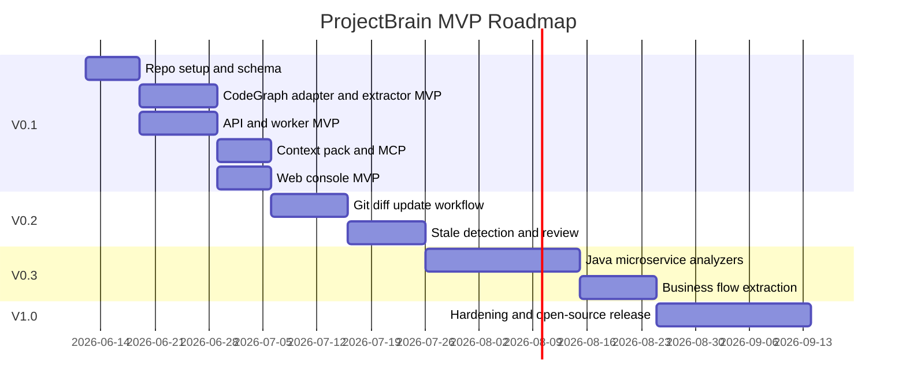

# ProjectBrain Implementation Plan

| Field | Value |
| --- | --- |
| Document | Implementation Plan |
| Project | ProjectBrain |
| Status | Draft |
| Last updated | 2026-06-12 |

## 1. 实施策略

ProjectBrain 应按“先建立可运行闭环，再扩语言和企业能力”的路线实施。

正确路线：

1. 设计文档。
2. 领域模型。
3. Knowledge Schema。
4. MVP 架构。
5. 实现。

当前文档集完成前四步，后续实现应避免过早引入复杂分布式架构。V0.1 应以单机 Docker Compose 可运行、可从 CodeGraph 导入代码事实、可被 MCP 调用为第一目标。

## 2. 里程碑



## 3. V0.1 Work Breakdown

### Phase 1: Repository Bootstrap

目标：建立开源项目工程结构。

任务：

| Task | Output |
| --- | --- |
| 创建 monorepo 目录结构 | `apps/`, `packages/`, `docs/`, `examples/` |
| 建立 Python project 配置 | `pyproject.toml`, lint, test |
| 建立 FastAPI app skeleton | health check, config, DB session |
| 建立 Alembic migrations | initial schema |
| 建立 Docker Compose | api, worker, postgres, web |
| 建立 CI | lint, unit test, migration check |

验收：

- 本地能启动 API。
- PostgreSQL + pgvector 可用。
- migration 可执行。
- CI 跑通基础测试。

### Phase 2: Core Schema and Storage

目标：实现 Knowledge Schema 的最小可用版本。

任务：

| Task | Output |
| --- | --- |
| Project model | project CRUD |
| SourceRoot model | source registration |
| Artifact model | artifact metadata |
| Entity model | knowledge_entities |
| Relation model | knowledge_relations |
| Claim model | knowledge_claims + sources |
| Memory model | memory_chunks |
| BrainRun model | run lifecycle |

验收：

- 可以创建项目。
- 可以写入 entity/relation/claim/source。
- claim 必须有 source 才能 active。
- lifecycle 状态机有单元测试。

### Phase 3: CodeGraph Adapter MVP

目标：从已有 CodeGraph 索引导入基础代码事实。

任务：

| Task | Output |
| --- | --- |
| CodeGraph index discovery | find `.codegraph/codegraph.db` or configured CodeGraph source |
| CodeGraph schema reader | read files/nodes/edges |
| Node mapper | KnowledgeEntity |
| Edge mapper | KnowledgeRelation |
| Source mapper | Source |
| Import job | BrainRun output |
| Markdown extractor | heading/doc chunks |
| Source locator | file/line/symbol evidence |

验收：

- 给定已有 CodeGraph index 的 sample repo，能输出 entities 和 relations。
- 每个 entity 有 stable_key。
- 每个 fact 有 source。
- CodeGraph 不存在时返回明确错误和修复建议。

### Phase 4: Knowledge Extraction MVP

目标：把 CodeGraph Adapter 和补充 extractor 输出转成 ProjectBrain 知识。

任务：

| Task | Output |
| --- | --- |
| Entity upsert | Project/Module/Class/Method/API |
| Relation upsert | CONTAINS/DECLARES/IMPORTS/CALLS |
| Basic dependency relation | DEPENDS_ON |
| Memory chunk generation | module summary |
| Project briefing generation | initial briefing |
| Confidence policy | FACT=1.0 |

验收：

- 初次导入后能看到项目地图。
- 所有事实可追溯。
- 生成一个 project briefing memory chunk。

### Phase 5: Context Pack API and MCP

目标：让外部 Agent 能消费 ProjectBrain。

任务：

| Task | Output |
| --- | --- |
| Context retrieval service | entity + memory retrieval |
| Token budget policy | max_tokens |
| Context pack formatter | JSON/Markdown |
| MCP server skeleton | tools list |
| `understand_project` tool | project briefing |
| `get_context_pack` tool | task context |

验收：

- 本地 MCP tool 可调用。
- 输入 task + files 能返回相关 context。
- context 中包含 source/confidence。

### Phase 6: Web Console MVP

目标：提供项目认知可视化和审核入口。

任务：

| Page | 功能 |
| --- | --- |
| Project List | 创建和查看项目 |
| Project Overview | 项目摘要、语言、模块 |
| Entity Explorer | 搜索实体 |
| Context Pack Preview | 输入任务预览上下文 |
| Claim Detail | 查看 claim、source、confidence |

验收：

- 用户可以从 UI 导入项目。
- 用户可以查看 Project Brain 基础内容。
- 用户可以复制或预览 context pack。

## 4. V0.2 Work Breakdown

### Phase 1: Git Diff Analyzer

任务：

- commit metadata ingestion。
- changed file detection。
- diff hunk parsing。
- changed symbol matching。
- changed entity event generation。

输出：

```json
{
  "changed_entities": [
    {
      "stable_key": "java:method:payment-service:RefundService#createRefund",
      "change_type": "modified",
      "source": "commit:abc123"
    }
  ]
}
```

### Phase 2: Brain Update Agent

任务：

- BrainRun state machine。
- impacted subgraph lookup。
- deterministic fact refresh。
- candidate claim generation。
- patch generation。
- run report。

### Phase 3: Stale Detection

规则：

- claim source file deleted -> stale。
- claim source line changed -> stale。
- referenced entity removed -> stale。
- old claim conflicts with new fact -> review_required。
- business concept touched by high-risk code -> review_required。

### Phase 4: Review Queue

任务：

- review task model。
- review API。
- review UI。
- approve/reject/supersede actions。

## 5. V0.3 Work Breakdown: Java Microservice

目标：ProjectBrain 对大型 Java 微服务项目产生明显价值。

### Java Analyzer

任务：

- Maven/Gradle module graph。
- Spring Boot app detection。
- `@RestController` route extraction。
- `@RequestMapping` method/path composition。
- `@Service`, `@Repository`, `@Component` role extraction。
- `@Transactional` boundary detection。
- `@Scheduled` job extraction。
- Feign client extraction。

### Data Access Analyzer

任务：

- MyBatis mapper interface extraction。
- MyBatis XML SQL extraction。
- JPA entity to table mapping。
- repository method heuristic。
- SQL table read/write detection。

### Messaging Analyzer

任务：

- Kafka listener detection。
- RocketMQ listener detection。
- topic string extraction。
- producer send detection。
- event type extraction。

### Business Flow Extraction

任务：

- 从 API handler 出发沿调用图找 service/repository/topic/table。
- 用 LLM 对候选路径命名业务流程。
- 高风险流程进入 review。

## 6. V1.0 Work Breakdown

目标：开源发布。

任务：

| Area | Tasks |
| --- | --- |
| Product | onboarding, sample projects, README |
| API | stable REST API, OpenAPI docs |
| MCP | stable MCP tools, examples for agents |
| Storage | migration stability, backup guidance |
| Security | secret handling, local auth option |
| Observability | structured logs, run metrics |
| Quality | integration tests, golden files |
| Docs | architecture docs, contributor guide |
| Governance | code of conduct, issue templates, roadmap |

## 7. Testing Strategy

### 7.1 Unit Tests

覆盖：

- stable_key generation。
- parser output normalization。
- confidence gate。
- lifecycle transition。
- source validation。
- relation upsert。

### 7.2 Golden File Tests

对 example repo 固定输出。

目录建议：

```text
tests/golden/
  java-basic/
    input/
    expected_entities.json
    expected_relations.json
    expected_claims.json
  python-basic/
  go-basic/
```

验收：

- parser 改动不能无意破坏 golden output。
- 允许通过 review 更新 expected。

### 7.3 Integration Tests

覆盖：

- create project -> ingestion -> entities created。
- context pack API returns source-linked facts。
- submit human claim -> review state correct。
- commit update -> stale claim created。

### 7.4 Agent Evaluation

构造任务：

- “给退款流程加手续费字段”。
- “解释支付回调为什么要幂等”。
- “修改 AccountRecord 删除逻辑是否安全”。

评估：

- context 是否包含关键约束。
- impact analysis 是否覆盖表/API/topic。
- 是否避免使用 rejected/stale knowledge。

## 8. Observability

### Metrics

| Metric | Meaning |
| --- | --- |
| `projectbrain.ingestion.duration` | 导入耗时 |
| `projectbrain.parser.files_total` | 解析文件数 |
| `projectbrain.parser.failures_total` | 解析失败数 |
| `projectbrain.entities.created_total` | 新实体数 |
| `projectbrain.relations.created_total` | 新关系数 |
| `projectbrain.claims.review_required_total` | 需审核 claim 数 |
| `projectbrain.context_pack.tokens` | context pack token 数 |
| `projectbrain.stale_claims.detected_total` | 过期知识数 |

### Logs

结构化日志必须包含：

- `project_id`
- `brain_run_id`
- `artifact_id`
- `source_root_id`
- `operation`
- `duration_ms`
- `error_type`

不得记录：

- repository credentials。
- API tokens。
- 私有代码大段内容。
- PII。

## 9. Security and Enterprise Concerns

### Repository Access

MVP：

- 支持本地 path。
- 支持 token 通过环境变量传入。
- token 不入库，只保存 auth_ref。

V1：

- secret manager adapter。
- per-project credential。
- audit log。

### Data Isolation

MVP：

- 单租户部署。
- project_id 分区。

V1：

- 多租户隔离。
- RBAC。
- organization-level policy。

### Code Privacy

策略：

- 默认不把完整私有代码发送给 LLM。
- LLM 输入只包含最小必要片段和摘要。
- 支持本地模型或企业私有 endpoint。
- 所有 LLM run 记录输入摘要、模型、时间、输出 claim，不长期保存敏感 prompt 原文，除非用户配置。

## 10. Open-source Project Setup

### Required Files

```text
LICENSE
README.md
CONTRIBUTING.md
CODE_OF_CONDUCT.md
SECURITY.md
docs/
examples/
docker-compose.yml
.github/workflows/ci.yml
.github/ISSUE_TEMPLATE/
```

### README 必须包含

- ProjectBrain 是什么。
- 不是什么。
- 快速开始。
- 示例项目。
- MCP 使用示例。
- 架构图。
- Roadmap。
- 贡献方式。

### Contributor Guide 必须包含

- 如何运行测试。
- 如何添加 FactSource Adapter。
- 如何添加 parser fallback。
- 如何添加 extractor。
- 如何更新 golden files。
- Knowledge pollution policy。
- Commit 和 PR 要求。

## 11. Implementation Risks

| Risk | Impact | Mitigation |
| --- | --- | --- |
| CodeGraph 事实不完整 | 影响分析漏报 | 明确 confidence，允许人工补充，逐步引入补充 analyzer |
| LLM 幻觉污染 | Agent 得到错误长期记忆 | source gate、confidence gate、review gate、rejected memory |
| 图数据库过早复杂化 | MVP 运维成本高 | V0.1 Postgres-first，V1 adapter |
| 文档变成一次性产物 | 知识过期 | commit update + stale detection |
| Java 企业项目复杂 | V0.1 价值不足 | V0.3 专门投入 Spring/MyBatis/JPA |
| Agent context 太大 | token 爆炸 | context pack budget 和 retrieval policy |
| 企业隐私顾虑 | 无法落地 | 支持本地部署、本地模型、最小 LLM 输入 |

## 12. Definition of Done

### V0.1 Done

- 文档集完整。
- Docker Compose 可启动 API、worker、web、postgres。
- 能从已有 CodeGraph index 导入一个 sample repo。
- 能生成 entities、relations、sources。
- 能通过 API 获取 context pack。
- MCP server 至少有两个可用 tool。
- 每条 claim 有 confidence 和 source。

### V0.2 Done

- commit event 可触发 update。
- diff 能定位 changed entities。
- stale claims 可生成。
- review queue 可操作。
- run report 可查看。

### V0.3 Done

- Spring Boot 示例项目识别 API、Service、Repository、Table、Topic。
- impact analysis 能跨 API、方法、表、topic。
- 退款/支付/账务示例流程可解释。

### V1.0 Done

- 新用户 15 分钟内跑通 quickstart。
- Coding Agent 可通过 MCP 使用 ProjectBrain。
- docs、tests、examples、CI 完整。
- 有明确插件开发指南。
- 有稳定 release tag。

## 13. 下一步实现建议

建议从以下文件开始编码：

1. `packages/schema/migrations/0001_initial.sql`
2. `apps/api/projectbrain_api/main.py`
3. `apps/api/projectbrain_api/routes/projects.py`
4. `packages/adapters/projectbrain_adapters/codegraph.py`
5. `packages/extractors/projectbrain_extractors/codegraph/basic.py`
6. `apps/worker/projectbrain_worker/jobs/ingest_project.py`
7. `apps/mcp-server/projectbrain_mcp/server.py`

第一条端到端链路：

```text
POST /projects
  -> POST /projects/{id}/ingestions
  -> worker reads CodeGraph index
  -> adapter maps files/classes/methods/edges
  -> extractor writes entities/relations/sources
  -> API returns project overview
  -> MCP returns project briefing
```
