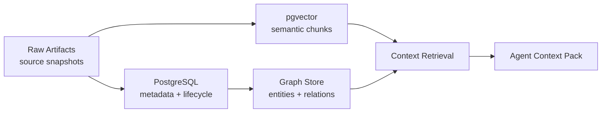
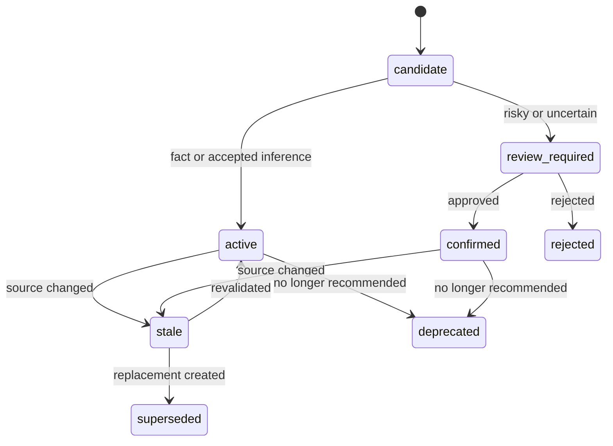

# ProjectBrain Knowledge Schema

| Field | Value |
| --- | --- |
| Document | Knowledge Schema |
| Project | ProjectBrain |
| Status | Draft |
| Last updated | 2026-06-12 |

## 1. Schema 目标

Knowledge Schema 需要支持 ProjectBrain 的四个基本能力：

1. 保存来自代码、Git、数据库、API、文档和人工输入的可追溯事实。
2. 保存 LLM 推理出的理解，但用置信度、来源和审核状态约束它。
3. 保存人工确认的经验，并让它能够约束 Agent 行为。
4. 支持代码变化后的知识更新、过期标记、冲突检测和版本演进。

## 2. 存储分层



| 存储 | 内容 | MVP 建议 |
| --- | --- | --- |
| PostgreSQL | project、source、artifact、claim、lifecycle、review、run 状态 | 必选 |
| pgvector | memory chunk、embedding、语义检索 | 必选 |
| Graph Store | entity、relation、path query、impact traversal | V0.1 可用 Postgres 表模拟，V1 引入 Apache AGE/Neo4j |
| Object Store | artifact snapshot、large raw content、run report | V0.1 可本地文件，V1 用 S3 compatible |

## 3. Knowledge Type

```text
FACT
AI_INFERENCE
HUMAN_CONFIRMED
HUMAN_NOTE
DECISION
INCIDENT_LEARNING
POLICY
```

| 类型 | 说明 | 默认置信度 | 是否可直接约束 Agent |
| --- | --- | --- | --- |
| `FACT` | parser、schema、Git 等确定性来源生成 | `1.0` | 是 |
| `AI_INFERENCE` | LLM 生成的理解 | `0.4-0.8` | 否，除非策略允许 |
| `HUMAN_CONFIRMED` | 人工确认经验 | `1.0` | 是 |
| `HUMAN_NOTE` | 未完全结构化人工记录 | `0.8` | 部分，需标注 pending |
| `DECISION` | ADR 或决策记录 | `0.9-1.0` | 是 |
| `INCIDENT_LEARNING` | 事故复盘经验 | `0.9-1.0` | 是 |
| `POLICY` | 团队、合规、安全策略 | `1.0` | 是 |

## 4. PostgreSQL Schema

### 4.1 projects

```sql
CREATE TABLE projects (
  id UUID PRIMARY KEY,
  name TEXT NOT NULL,
  repository_url TEXT,
  default_branch TEXT,
  description TEXT,
  primary_languages TEXT[] NOT NULL DEFAULT '{}',
  metadata JSONB NOT NULL DEFAULT '{}',
  created_at TIMESTAMPTZ NOT NULL,
  updated_at TIMESTAMPTZ NOT NULL,
  last_indexed_at TIMESTAMPTZ
);
```

### 4.2 source_roots

```sql
CREATE TABLE source_roots (
  id UUID PRIMARY KEY,
  project_id UUID NOT NULL REFERENCES projects(id),
  type TEXT NOT NULL,
  uri TEXT NOT NULL,
  auth_ref TEXT,
  sync_policy JSONB NOT NULL DEFAULT '{}',
  status TEXT NOT NULL DEFAULT 'active',
  last_synced_at TIMESTAMPTZ,
  created_at TIMESTAMPTZ NOT NULL
);
```

### 4.3 artifacts

```sql
CREATE TABLE artifacts (
  id UUID PRIMARY KEY,
  project_id UUID NOT NULL REFERENCES projects(id),
  source_root_id UUID REFERENCES source_roots(id),
  artifact_type TEXT NOT NULL,
  path TEXT,
  version_ref TEXT,
  content_hash TEXT NOT NULL,
  language TEXT,
  metadata JSONB NOT NULL DEFAULT '{}',
  status TEXT NOT NULL DEFAULT 'active',
  created_at TIMESTAMPTZ NOT NULL,
  updated_at TIMESTAMPTZ NOT NULL
);

CREATE INDEX idx_artifacts_project_path ON artifacts(project_id, path);
CREATE INDEX idx_artifacts_hash ON artifacts(content_hash);
```

### 4.4 sources

Source 是 claim 的证据。一个 Source 可以指向代码位置、commit、PR、文档段落、数据库 schema 或人工输入。

```sql
CREATE TABLE sources (
  id UUID PRIMARY KEY,
  project_id UUID NOT NULL REFERENCES projects(id),
  source_type TEXT NOT NULL,
  artifact_id UUID REFERENCES artifacts(id),
  uri TEXT,
  version_ref TEXT,
  locator JSONB NOT NULL DEFAULT '{}',
  quote TEXT,
  content_hash TEXT,
  status TEXT NOT NULL DEFAULT 'active',
  created_at TIMESTAMPTZ NOT NULL
);

CREATE INDEX idx_sources_project_type ON sources(project_id, source_type);
```

示例 locator：

```json
{
  "file": "payment-service/src/main/java/com/acme/payment/RefundService.java",
  "start_line": 42,
  "end_line": 68,
  "symbol": "RefundService.createRefund"
}
```

### 4.5 knowledge_entities

```sql
CREATE TABLE knowledge_entities (
  id UUID PRIMARY KEY,
  project_id UUID NOT NULL REFERENCES projects(id),
  entity_type TEXT NOT NULL,
  stable_key TEXT NOT NULL,
  name TEXT NOT NULL,
  qualified_name TEXT,
  description TEXT,
  properties JSONB NOT NULL DEFAULT '{}',
  lifecycle_state TEXT NOT NULL DEFAULT 'active',
  first_seen_at TIMESTAMPTZ NOT NULL,
  last_seen_at TIMESTAMPTZ NOT NULL,
  created_at TIMESTAMPTZ NOT NULL,
  updated_at TIMESTAMPTZ NOT NULL,
  UNIQUE(project_id, stable_key)
);

CREATE INDEX idx_entities_project_type ON knowledge_entities(project_id, entity_type);
CREATE INDEX idx_entities_qualified_name ON knowledge_entities(project_id, qualified_name);
```

stable_key 示例：

```text
java:class:payment-service:com.acme.payment.RefundService
java:method:payment-service:com.acme.payment.RefundService#createRefund(RefundRequest)
db:table:payment.refund_record
api:http:POST:/api/refunds
concept:refund_handling_fee
```

### 4.6 knowledge_relations

```sql
CREATE TABLE knowledge_relations (
  id UUID PRIMARY KEY,
  project_id UUID NOT NULL REFERENCES projects(id),
  relation_type TEXT NOT NULL,
  from_entity_id UUID NOT NULL REFERENCES knowledge_entities(id),
  to_entity_id UUID NOT NULL REFERENCES knowledge_entities(id),
  properties JSONB NOT NULL DEFAULT '{}',
  confidence NUMERIC(4,3) NOT NULL,
  lifecycle_state TEXT NOT NULL DEFAULT 'active',
  first_seen_at TIMESTAMPTZ NOT NULL,
  last_seen_at TIMESTAMPTZ NOT NULL,
  created_at TIMESTAMPTZ NOT NULL,
  updated_at TIMESTAMPTZ NOT NULL
);

CREATE INDEX idx_relations_from ON knowledge_relations(project_id, from_entity_id, relation_type);
CREATE INDEX idx_relations_to ON knowledge_relations(project_id, to_entity_id, relation_type);
```

### 4.7 knowledge_claims

```sql
CREATE TABLE knowledge_claims (
  id UUID PRIMARY KEY,
  project_id UUID NOT NULL REFERENCES projects(id),
  claim_type TEXT NOT NULL,
  subject_entity_id UUID REFERENCES knowledge_entities(id),
  predicate TEXT NOT NULL,
  object_entity_id UUID REFERENCES knowledge_entities(id),
  statement TEXT NOT NULL,
  confidence NUMERIC(4,3) NOT NULL,
  lifecycle_state TEXT NOT NULL DEFAULT 'candidate',
  review_state TEXT NOT NULL DEFAULT 'not_required',
  risk_level TEXT NOT NULL DEFAULT 'normal',
  valid_from TIMESTAMPTZ NOT NULL,
  valid_to TIMESTAMPTZ,
  supersedes_claim_id UUID REFERENCES knowledge_claims(id),
  created_by TEXT NOT NULL,
  updated_by TEXT,
  metadata JSONB NOT NULL DEFAULT '{}',
  created_at TIMESTAMPTZ NOT NULL,
  updated_at TIMESTAMPTZ NOT NULL
);

CREATE INDEX idx_claims_project_subject ON knowledge_claims(project_id, subject_entity_id);
CREATE INDEX idx_claims_lifecycle ON knowledge_claims(project_id, lifecycle_state, review_state);
```

### 4.8 claim_sources

```sql
CREATE TABLE claim_sources (
  claim_id UUID NOT NULL REFERENCES knowledge_claims(id),
  source_id UUID NOT NULL REFERENCES sources(id),
  evidence_role TEXT NOT NULL DEFAULT 'supporting',
  created_at TIMESTAMPTZ NOT NULL,
  PRIMARY KEY (claim_id, source_id)
);
```

### 4.9 memory_chunks

```sql
CREATE EXTENSION IF NOT EXISTS vector;

CREATE TABLE memory_chunks (
  id UUID PRIMARY KEY,
  project_id UUID NOT NULL REFERENCES projects(id),
  chunk_type TEXT NOT NULL,
  title TEXT,
  content TEXT NOT NULL,
  entity_ids UUID[] NOT NULL DEFAULT '{}',
  claim_ids UUID[] NOT NULL DEFAULT '{}',
  source_ids UUID[] NOT NULL DEFAULT '{}',
  embedding vector(1536),
  lifecycle_state TEXT NOT NULL DEFAULT 'active',
  confidence NUMERIC(4,3) NOT NULL,
  token_count INTEGER,
  created_at TIMESTAMPTZ NOT NULL,
  updated_at TIMESTAMPTZ NOT NULL
);

CREATE INDEX idx_memory_project_type ON memory_chunks(project_id, chunk_type);
```

### 4.10 brain_runs

```sql
CREATE TABLE brain_runs (
  id UUID PRIMARY KEY,
  project_id UUID NOT NULL REFERENCES projects(id),
  run_type TEXT NOT NULL,
  trigger_type TEXT NOT NULL,
  trigger_ref TEXT,
  status TEXT NOT NULL,
  input JSONB NOT NULL DEFAULT '{}',
  output JSONB NOT NULL DEFAULT '{}',
  error JSONB,
  started_at TIMESTAMPTZ,
  completed_at TIMESTAMPTZ,
  created_at TIMESTAMPTZ NOT NULL
);

CREATE INDEX idx_brain_runs_project_status ON brain_runs(project_id, status);
```

### 4.11 review_tasks

```sql
CREATE TABLE review_tasks (
  id UUID PRIMARY KEY,
  project_id UUID NOT NULL REFERENCES projects(id),
  task_type TEXT NOT NULL,
  status TEXT NOT NULL DEFAULT 'open',
  priority TEXT NOT NULL DEFAULT 'normal',
  claim_id UUID REFERENCES knowledge_claims(id),
  entity_id UUID REFERENCES knowledge_entities(id),
  title TEXT NOT NULL,
  description TEXT,
  assigned_to TEXT,
  decision TEXT,
  decision_reason TEXT,
  created_at TIMESTAMPTZ NOT NULL,
  resolved_at TIMESTAMPTZ
);
```

## 5. Graph Schema

### 5.1 Node labels

| Label | Key properties |
| --- | --- |
| `Project` | `id`, `name` |
| `Module` | `stable_key`, `name`, `path` |
| `Service` | `stable_key`, `name`, `runtime`, `owner_team` |
| `Class` | `stable_key`, `qualified_name`, `language` |
| `Method` | `stable_key`, `signature`, `visibility` |
| `DatabaseTable` | `stable_key`, `schema`, `table_name` |
| `API` | `stable_key`, `method`, `path` |
| `MessageTopic` | `stable_key`, `broker`, `topic` |
| `BusinessConcept` | `stable_key`, `name`, `domain`, `criticality` |
| `BusinessFlow` | `stable_key`, `name`, `criticality` |
| `Decision` | `stable_key`, `status`, `decided_at` |
| `Incident` | `stable_key`, `severity`, `happened_at` |
| `Constraint` | `stable_key`, `constraint_type`, `severity` |
| `KnowledgeClaim` | `id`, `claim_type`, `confidence`, `lifecycle_state` |
| `Source` | `id`, `source_type`, `uri` |

### 5.2 Edge types

| Edge | Direction | Confidence |
| --- | --- | --- |
| `CONTAINS` | parent -> child | 1.0 |
| `CALLS` | method -> method | 0.7-1.0 |
| `DEPENDS_ON` | entity -> entity | 1.0 |
| `READS` | method/service -> table | 0.7-1.0 |
| `WRITES` | method/service -> table | 0.7-1.0 |
| `HANDLED_BY` | api -> method | 1.0 |
| `PUBLISHES` | method/service -> topic | 0.7-1.0 |
| `CONSUMES` | method/service -> topic | 0.7-1.0 |
| `IMPLEMENTS` | code entity -> business concept | 0.4-1.0 |
| `PART_OF_FLOW` | entity -> business flow | 0.4-1.0 |
| `AFFECTS` | decision/incident/constraint -> entity | 0.6-1.0 |
| `CAUSED_BY` | incident -> entity/decision | 0.6-1.0 |
| `SOLVED_BY` | incident -> decision/commit | 0.6-1.0 |
| `EVIDENCED_BY` | claim -> source | 1.0 |
| `SUPERSEDES` | claim -> claim | 1.0 |

## 6. Confidence Model

### 6.1 Confidence 来源

```text
confidence = source_reliability * extraction_reliability * corroboration_factor * recency_factor
```

MVP 不需要过度复杂，可使用规则化计算：

| 来源 | source_reliability |
| --- | --- |
| parser fact | 1.0 |
| database introspection | 1.0 |
| Git commit metadata | 1.0 |
| ADR / approved docs | 0.95 |
| incident postmortem | 0.95 |
| human confirmed | 1.0 |
| LLM inference from multiple facts | 0.7 |
| LLM inference from weak context | 0.4 |
| unlinked manual note | 0.6 |

### 6.2 Confidence gate

| Gate | 条件 | 动作 |
| --- | --- | --- |
| Auto publish fact | `claim_type=FACT` 且有 source | 进入 active |
| Auto publish low-risk inference | `confidence>=0.75` 且 risk normal | 进入 active，但标记 AI |
| Review required | `confidence<0.75` 或 risk high | 进入 review_required |
| Reject | 无 source 或 source 不可追踪 | rejected |
| Human confirmed | reviewer approve | confirmed |

## 7. Source Traceability

每条 claim 必须能回答：

- 这条知识来自哪里？
- 来源是否仍然存在？
- 来源版本是什么？
- 来源是代码、文档、commit 还是人？
- 如果来源变化，这条知识是否需要过期？

Source 类型：

```text
code_location
git_commit
pull_request
database_schema
openapi_spec
protobuf_spec
message_schema
markdown_doc
adr
incident_report
manual_input
agent_run
```

## 8. Knowledge Lifecycle



生命周期规则：

- `FACT` 可以自动从 `candidate` 到 `active`。
- `AI_INFERENCE` 不能直接到 `confirmed`。
- `HUMAN_CONFIRMED` 必须有 reviewer 或来源。
- `stale` 不等于错误，只表示需要重新验证。
- `superseded` 必须指向替代 claim。
- `rejected` 永久保留，避免重复生成同类污染。

## 9. Knowledge Pollution 防护

### 9.1 污染类型

| 类型 | 示例 | 防护 |
| --- | --- | --- |
| 无来源幻觉 | “RefundService 属于清结算域”但没有证据 | source gate |
| 错误泛化 | 从一个方法推断整个服务职责 | confidence 降权 |
| 过期知识 | 代码已改但旧总结仍 active | stale detector |
| 冲突知识 | 两条 claim 互相矛盾 | conflict detector |
| 人工经验未关联 | “这里不能删”但不知道指哪里 | linking queue |
| 高风险自动发布 | 财务、权限、合规知识未经审核 | risk policy |

### 9.2 写入策略

任何写入长期记忆的候选知识必须通过：

1. **Source Gate**：至少一个 source。
2. **Schema Gate**：subject、predicate、object 或 statement 类型合法。
3. **Confidence Gate**：置信度达到发布阈值。
4. **Risk Gate**：高风险知识进入 review。
5. **Conflict Gate**：与 active/confirmed claim 冲突时进入 review。
6. **Lifecycle Gate**：替代旧知识时创建 `SUPERSEDES`，不覆盖历史。

## 10. Memory Chunk 设计

MemoryChunk 面向 Agent 检索，不等于知识真相本身。它是 claim、entity、source 的可读压缩表示。

类型：

- `project_briefing`
- `module_summary`
- `service_summary`
- `business_flow_summary`
- `constraint_note`
- `decision_summary`
- `incident_learning`
- `change_summary`
- `review_hint`

MemoryChunk 示例：

```json
{
  "chunk_type": "constraint_note",
  "title": "AccountRecord deletion constraint",
  "content": "AccountRecord must not be physically deleted because it is used for financial audit and reconciliation.",
  "entity_ids": ["ent_account_record"],
  "claim_ids": ["claim_no_physical_delete"],
  "source_ids": ["src_adr_0042"],
  "confidence": 1.0,
  "lifecycle_state": "active"
}
```

## 11. Graph Patch 和 Memory Patch

Brain Update Agent 不应直接无审计地修改图谱。每次更新产生 patch。

```json
{
  "patch_id": "patch_01J...",
  "brain_run_id": "run_01J...",
  "project_id": "proj_payment",
  "operations": [
    {
      "op": "upsert_entity",
      "entity": {
        "type": "BusinessConcept",
        "stable_key": "concept:refund_handling_fee",
        "name": "Refund Handling Fee"
      }
    },
    {
      "op": "mark_stale",
      "claim_id": "claim_refund_amount_equals_order_amount",
      "reason": "Refund fee calculation changed in commit abc123"
    }
  ],
  "requires_review": true
}
```

## 12. Versioning

版本原则：

- Entity 使用 stable_key 标识逻辑实体。
- Source 使用 `version_ref` 标识来源版本，例如 commit sha。
- Claim 不原地覆盖语义变更，而是新增 claim 并 `SUPERSEDES` 旧 claim。
- Artifact 使用 content_hash 判断是否变化。
- BrainRun 记录每次变更的输入输出。

## 13. Minimal Predicate Set for MVP

V0.1 不需要支持所有关系，建议最小集：

```text
CONTAINS
DECLARES
CALLS
DEPENDS_ON
HANDLED_BY
READS
WRITES
IMPLEMENTS
PART_OF_FLOW
AFFECTS
EVIDENCED_BY
SUPERSEDES
```

这些关系足以支持：

- 项目地图。
- 影响分析。
- 架构解释。
- 业务概念关联。
- 过期知识检测。

