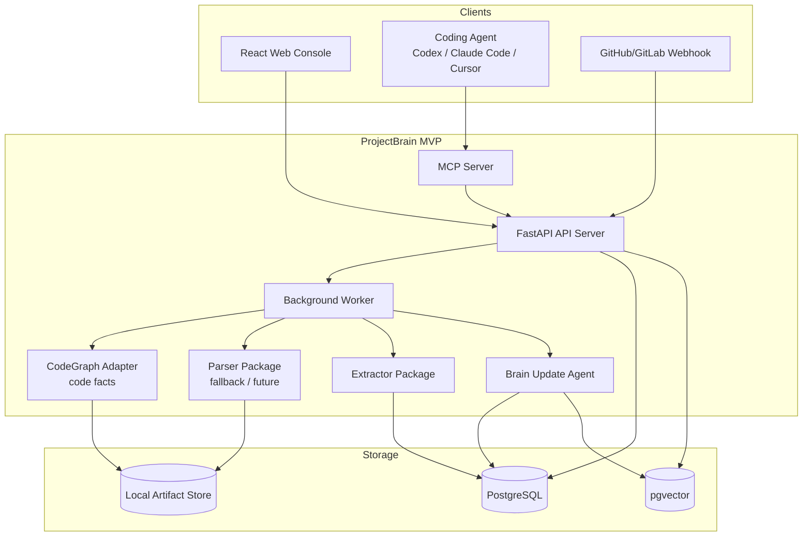
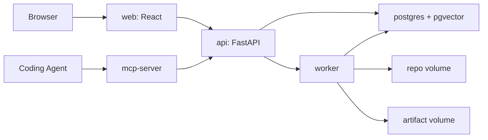
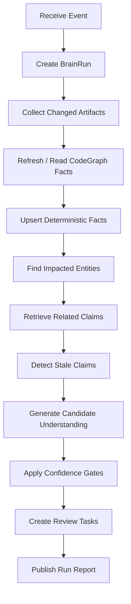

# ProjectBrain MVP Architecture

| Field | Value |
| --- | --- |
| Document | MVP Architecture |
| Project | ProjectBrain |
| Status | Draft |
| Last updated | 2026-06-12 |

## 1. MVP 原则

ProjectBrain 的 MVP 不能做成一个宏大的“全知识系统”。首个可用版本必须能被开发者在本地跑起来，并且能服务真实 Coding Agent 工作流。

MVP 目标：

- 支持一个本地或远程 Git repository。
- V0.1 优先复用 CodeGraph 索引，导入项目结构、关键代码实体和基础关系。
- 能生成 Agent 可消费的 context pack。
- 能对 commit/PR diff 做基础影响分析。
- 能存储带来源和置信度的知识。
- 能标记可能过期的知识。

MVP 非目标：

- 不做完整 IDE。
- 不追求所有语言 100% 准确静态分析。
- 不替代 CodeGraph。
- 不做企业级权限系统。
- 不做复杂跨组织知识治理。
- 不要求一开始支持全部图数据库能力。

## 2. MVP 系统架构



## 3. 服务边界

### 3.1 API Server

技术：

- Python 3.12
- FastAPI
- SQLAlchemy 或 SQLModel
- Alembic
- Pydantic

职责：

- Project CRUD。
- Ingestion job 创建。
- Context Pack API。
- Impact Analysis API。
- Claim review API。
- Webhook receiver。
- Web Console backend。

不负责：

- 长时间代码解析。
- LLM 推理执行。
- 大规模 embedding 生成。

### 3.2 Worker

技术：

- Python worker。
- V0.1 可使用 Postgres-backed job queue 或 RQ。
- V1 可演进到 Temporal/Celery/Kafka。

职责：

- repository checkout / refresh。
- artifact snapshot。
- CodeGraph fact import。
- parser fallback execution。
- extractor execution。
- embedding generation。
- Brain Update Agent run。
- graph patch apply。

### 3.3 MCP Server

职责：

- 暴露 Coding Agent tools。
- 将 Agent 请求转成 ProjectBrain API 调用。
- 管理 token budget 和 context pack 输出格式。

MVP tools：

```text
projectbrain_understand_project
projectbrain_get_context_pack
projectbrain_analyze_impact
projectbrain_explain_architecture
projectbrain_submit_memory
```

### 3.4 CodeGraph Adapter

职责：

- 读取本地 CodeGraph 索引或调用 CodeGraph MCP/CLI。
- 导入 files、symbols、routes、call edges、import edges。
- 映射为 ProjectBrain entity/relation/source。
- 为 Context Pack 和 Impact Analysis 提供代码事实。

V0.1 建议：

- 优先支持本地 `.codegraph/codegraph.db`。
- adapter 层隔离 CodeGraph 内部 schema。
- 如果 CodeGraph 索引不存在，提示用户先对项目运行 CodeGraph。

### 3.5 Parser Package

职责：

- language detection。
- Tree-sitter parsing。
- symbol extraction。
- import/dependency extraction。
- route/config/schema basic extraction。

V0.1 定位：

- 作为 fallback，不作为主路径。
- 只做少量补充解析，例如 Markdown、SQL migration、配置。

后续支持：

- Java class/method/import。
- Python function/class/import。
- Go package/function/type/import。
- Markdown heading extraction。
- SQL migration file detection。

V0.3 增强：

- Spring annotation。
- Maven/Gradle module。
- MyBatis mapper XML。
- JPA entity。
- OpenAPI route mapping。

### 3.6 Extractor Package

职责：

- 将 CodeGraph Adapter 和 parser 输出转成 KnowledgeEntity。
- 将调用、依赖、包含关系转成 KnowledgeRelation。
- 将文档和人工输入转成 KnowledgeClaim candidate。
- 生成 source 和 evidence link。

### 3.7 Brain Update Agent

MVP 职责：

- 接收 changed files 和 CodeGraph facts。
- 找出受影响实体。
- 更新 deterministic facts。
- 对语义变化生成 candidate claims。
- 标记相关 memory chunks stale。
- 创建 review tasks。

## 4. Docker Compose 架构



服务：

| Service | Port | 说明 |
| --- | --- | --- |
| `api` | 8000 | FastAPI |
| `worker` | none | background job |
| `web` | 3000 | React dev/prod server |
| `mcp-server` | 8765 | MCP endpoint or stdio adapter |
| `postgres` | 5432 | PostgreSQL + pgvector |

卷：

| Volume | 用途 |
| --- | --- |
| `projectbrain_pgdata` | PostgreSQL 数据 |
| `projectbrain_repos` | checkout 的 repository |
| `projectbrain_artifacts` | artifact snapshots 和 run reports |

## 5. Repository 结构

```text
projectbrain/
  apps/
    api/
      projectbrain_api/
        routes/
        services/
        models/
        db/
    worker/
      projectbrain_worker/
        jobs/
        runners/
    web/
      src/
    mcp-server/
      projectbrain_mcp/
  packages/
    parsers/
      projectbrain_parsers/
        tree_sitter/
        java/
        python/
        go/
    extractors/
      projectbrain_extractors/
        code/
        git/
        docs/
        schema/
    schema/
      migrations/
      sql/
    agent-skills/
      projectbrain_skills/
  docs/
    projectbrain/
    adr/
  examples/
    java-spring-microservices/
  docker-compose.yml
  pyproject.toml
```

## 6. V0.1 功能边界

### 6.1 输入

- 本地 repository path。
- CodeGraph index 或可运行的 CodeGraph。
- Git repository URL。
- 可选：README、docs、ADR。
- 可选：手工输入项目说明。

### 6.2 输出

- Project map。
- Module map。
- Code entity list。
- Basic dependency graph。
- Initial project briefing。
- Context pack。
- Knowledge claims with sources。

### 6.3 必须支持的用户流程

#### 流程一：导入项目

1. 用户在 Web Console 输入 repository。
2. API 创建 project 和 ingestion run。
3. Worker checkout repository，并确认 CodeGraph index 可用。
4. CodeGraph Adapter 导入 files、symbols、edges。
5. Extractor 写入 entities、relations、sources。
6. Agent 生成项目 briefing memory chunks。
7. Web Console 展示项目地图。

#### 流程二：Agent 请求项目理解

1. Coding Agent 调用 MCP `projectbrain_understand_project`。
2. MCP 调用 Context Pack API。
3. API 从 entity、claim、memory 中检索。
4. 返回适配 token budget 的 context pack。

#### 流程三：分析变更影响

1. Coding Agent 提交 diff 或 changed files。
2. ProjectBrain 定位 changed symbols。
3. 查询相关关系：CALLS、READS、WRITES、IMPLEMENTS。
4. 返回受影响模块、表、API、业务概念和约束。

## 7. V0.1 API Surface

### 7.1 Create Project

`POST /api/v1/projects`

```json
{
  "name": "payment-platform",
  "repository_url": "https://github.com/acme/payment-platform",
  "default_branch": "main"
}
```

### 7.2 Start Ingestion

`POST /api/v1/projects/{project_id}/ingestions`

```json
{
  "source": {
    "type": "git_repository",
    "ref": "main"
  },
  "options": {
    "include_git_history": false,
    "include_docs": true,
    "max_files": 20000
  }
}
```

### 7.3 Get Context Pack

`POST /api/v1/projects/{project_id}/context-pack`

```json
{
  "task": "Understand refund implementation",
  "files": ["payment-service/src/main/java/com/acme/payment/RefundService.java"],
  "max_tokens": 6000,
  "include": ["summary", "facts", "constraints", "flows"]
}
```

### 7.4 Impact Analysis

`POST /api/v1/projects/{project_id}/impact-analysis`

```json
{
  "change": {
    "type": "diff",
    "content": "diff --git ..."
  },
  "depth": 3,
  "include_risks": true
}
```

### 7.5 Submit Human Memory

`POST /api/v1/projects/{project_id}/claims`

```json
{
  "statement": "AccountRecord must not be physically deleted because it is used for financial audit.",
  "claim_type": "HUMAN_CONFIRMED",
  "subject": {
    "stable_key": "db:table:account.account_record"
  },
  "predicate": "HAS_CONSTRAINT",
  "risk_level": "high",
  "sources": [
    {
      "source_type": "manual_input",
      "uri": "projectbrain://manual/notes/..."
    }
  ]
}
```

## 8. Brain Update Agent MVP

### 8.1 输入事件

```json
{
  "event_type": "git_commit",
  "project_id": "proj_...",
  "commit_sha": "abc123",
  "message": "增加退款手续费",
  "changed_files": [
    "payment-service/src/main/java/com/acme/payment/RefundService.java",
    "payment-service/src/main/java/com/acme/payment/RefundFeeCalculator.java"
  ]
}
```

### 8.2 执行步骤



### 8.3 V0.1 限制

- CALLS 关系质量依赖 CodeGraph；ProjectBrain 不在 V0.1 重建 call graph。
- 业务概念识别只作为 candidate。
- 不做跨 repository 全链路追踪。
- 不自动阻断 PR，只输出建议。

## 9. Frontend MVP

页面：

| Page | 功能 |
| --- | --- |
| Project List | 查看项目、创建项目。 |
| Project Overview | 项目 briefing、语言、模块、更新时间。 |
| Entity Explorer | 搜索实体和关系。 |
| Context Pack Preview | 输入任务，预览给 Agent 的上下文包。 |
| Impact Analysis | 输入 diff 或文件，查看影响。 |
| Review Queue | 审核 AI inference 和 stale claims。 |

UI 原则：

- 面向工程师，不做营销页。
- 信息密度高但清晰。
- 每条知识都展示 source、confidence、lifecycle。
- 高风险 constraint 显著展示。

## 10. V0.2 增量架构

新增：

- GitHub/GitLab webhook。
- Commit diff analyzer。
- BrainRun report。
- Stale detector。
- Review task workflow。

数据新增：

- `git_commits`
- `git_diffs`
- `graph_patches`
- `memory_patches`
- `review_tasks`

Agent 新增：

- `update_from_commit`
- `summarize_change`
- `detect_stale_knowledge`

## 11. V0.3 增量架构

面向大型 Java 微服务项目。

新增 analyzer：

- Maven/Gradle。
- Spring Controller route。
- Spring Service/Repository。
- MyBatis XML。
- JPA Entity。
- Kafka/RocketMQ consumer。
- SQL table read/write。

新增实体：

- `Service`
- `Controller`
- `Repository`
- `Mapper`
- `Job`
- `ExternalClient`
- `MessageTopic`

新增能力：

- API 到 handler 追踪。
- 方法到表读写追踪。
- 消息 topic 发布消费追踪。
- 微服务模块地图。

## 12. V1.0 架构

V1.0 应达到“可作为 Coding Agent Memory Layer 使用”的标准。

能力：

- 多项目。
- MCP server 稳定。
- Knowledge lifecycle 完整。
- Human review UI 完整。
- Confidence policy 可配置。
- Docker Compose 一键启动。
- GitHub/GitLab integration。
- 文档和 example repo 完整。

可选增强：

- Neo4j/Apache AGE adapter。
- Temporal workflow。
- Team/role permission。
- Jira/Linear integration。
- IDE extension。

## 13. 验收标准

### V0.1 验收

- 能导入一个中型 repository。
- 能从 CodeGraph 导入文件、类、方法、基础依赖和调用关系。
- 每个 fact 都有 source。
- 能生成 context pack。
- MCP tool 能被本地 Agent 调用。
- 文档说明如何本地启动。

### V0.2 验收

- commit diff 能触发 BrainRun。
- 能定位 changed entities。
- 能标记 stale claims。
- 能生成 impact summary。
- review queue 可查看。

### V0.3 验收

- Java Spring Boot 示例项目能识别 Controller、Service、Repository、API、表读写。
- refund/payment/accounting 示例能形成业务流程。
- impact analysis 能返回相关表、API、topic 和约束。

### V1.0 验收

- 完整 Docker Compose 部署。
- README 可让新用户 15 分钟内跑通示例。
- MCP integration 可实际给 Coding Agent 提供上下文。
- Knowledge pollution gates 生效。
- Human review workflow 可用。
