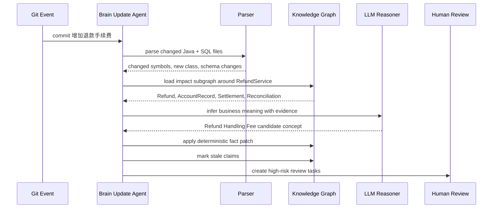
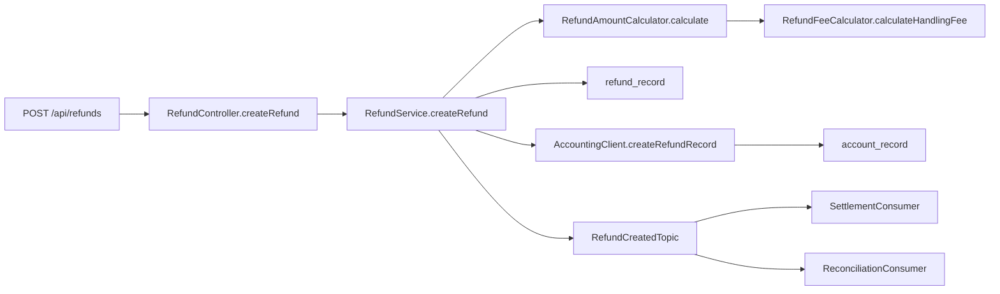
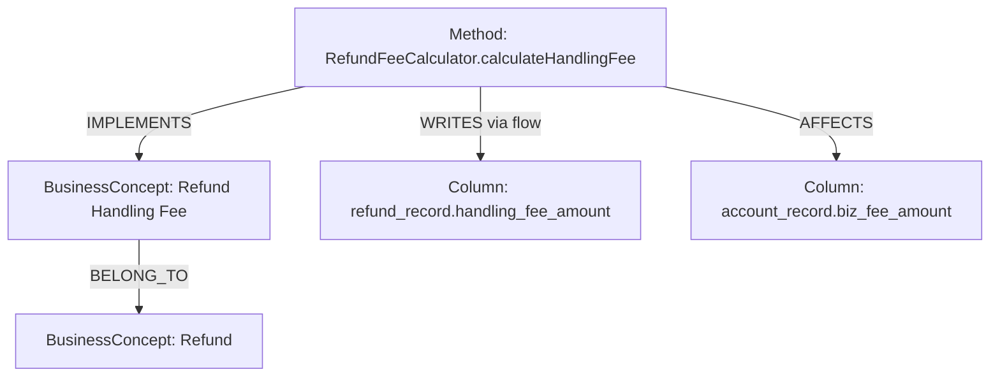

# Refund Handling Fee Walkthrough

| Field | Value |
| --- | --- |
| Document | End-to-end Walkthrough |
| Scenario | 增加退款手续费 |
| Project | ProjectBrain |
| Status | Draft |
| Last updated | 2026-06-12 |

## 1. 目标

本文用一个真实企业系统中常见的变更贯穿 ProjectBrain 的完整工作流：

> commit: `增加退款手续费`

这个 walkthrough 用来验证 ProjectBrain 是否真的能从代码变化中理解业务变化，并把变化沉淀进长期项目记忆。

需要验证的能力：

- 识别 commit diff 中的代码事实变化。
- 定位受影响的服务、方法、表、API、消息和业务概念。
- 发现新增业务概念：退款手续费。
- 更新 Knowledge Graph。
- 标记旧知识过期。
- 触发高风险人工审核。
- 为 Coding Agent 生成下一次任务可用的 context pack。

## 2. 示例业务背景

假设存在一个大型 Java Spring 微服务系统：

```text
payment-platform/
  payment-service/
  accounting-service/
  settlement-service/
  reconciliation-service/
```

核心业务流程：

1. 用户发起退款。
2. `payment-service` 校验订单和支付状态。
3. `payment-service` 计算退款金额。
4. `accounting-service` 写入账务流水。
5. `settlement-service` 在结算周期处理退款影响。
6. `reconciliation-service` 做渠道对账。

已有经验约束：

- `AccountRecord` 不允许物理删除，因为涉及财务审计。
- 支付和退款相关 callback 必须幂等。
- 账务金额必须以分为单位存储。
- 退款金额变化会影响结算和对账。

## 3. 变更前 Project Brain

### 3.1 业务概念

| BusinessConcept | Description | Confidence | Source |
| --- | --- | --- | --- |
| `Refund` | 退款生命周期，包括退款请求、金额计算、账务记录。 | 0.86 | code + docs |
| `AccountRecord` | 账务流水，用于审计、结算和对账。 | 1.0 | DDL + ADR |
| `Settlement` | 资金结算流程。 | 0.82 | code + docs |
| `Reconciliation` | 渠道对账流程。 | 0.8 | code + docs |

### 3.2 关键实体

| Entity | Type | Responsibility |
| --- | --- | --- |
| `RefundController.createRefund` | API handler | 接收退款请求。 |
| `RefundService.createRefund` | Method | 编排退款创建。 |
| `RefundAmountCalculator.calculate` | Method | 计算退款金额。 |
| `AccountingClient.createRefundRecord` | Method | 调用账务服务创建账务流水。 |
| `account_record` | DatabaseTable | 保存账务流水。 |
| `refund_record` | DatabaseTable | 保存退款记录。 |
| `RefundCreatedTopic` | MessageTopic | 通知退款创建完成。 |

### 3.3 变更前知识断言

```json
[
  {
    "id": "claim_refund_amount_equals_order_remaining_amount",
    "claim_type": "AI_INFERENCE",
    "statement": "Refund amount is calculated from the remaining refundable order amount.",
    "subject": "RefundAmountCalculator.calculate",
    "predicate": "CALCULATES",
    "object": "Refund",
    "confidence": 0.74,
    "lifecycle_state": "active",
    "review_state": "pending",
    "sources": ["src_refund_amount_calculator_v1"]
  },
  {
    "id": "claim_account_record_append_only",
    "claim_type": "HUMAN_CONFIRMED",
    "statement": "AccountRecord must be append-only and must not be physically deleted because it is used for financial audit.",
    "subject": "db:table:account.account_record",
    "predicate": "HAS_CONSTRAINT",
    "object": null,
    "confidence": 1.0,
    "lifecycle_state": "confirmed",
    "review_state": "approved",
    "risk_level": "high",
    "sources": ["src_adr_financial_audit"]
  }
]
```

## 4. 示例 Commit

commit message:

```text
增加退款手续费
```

changed files:

```text
payment-service/src/main/java/com/acme/payment/refund/RefundService.java
payment-service/src/main/java/com/acme/payment/refund/RefundAmountCalculator.java
payment-service/src/main/java/com/acme/payment/refund/RefundFeeCalculator.java
payment-service/src/main/java/com/acme/payment/refund/dto/RefundRequest.java
payment-service/src/main/resources/db/migration/V20260612__add_refund_fee.sql
accounting-service/src/main/java/com/acme/accounting/AccountRecordClient.java
```

示例 diff 摘要：

```diff
+ class RefundFeeCalculator {
+   Money calculateHandlingFee(RefundRequest request) { ... }
+ }

  class RefundAmountCalculator {
-   Money calculate(RefundRequest request) { ... }
+   RefundAmount calculate(RefundRequest request) {
+     Money handlingFee = refundFeeCalculator.calculateHandlingFee(request);
+     Money actualRefundAmount = originalRefundAmount.minus(handlingFee);
+     return new RefundAmount(originalRefundAmount, handlingFee, actualRefundAmount);
+   }
  }

+ ALTER TABLE refund_record ADD COLUMN handling_fee_amount BIGINT NOT NULL DEFAULT 0;
+ ALTER TABLE account_record ADD COLUMN biz_fee_amount BIGINT NOT NULL DEFAULT 0;
```

## 5. Brain Update Agent 执行流程



## 6. Step 1: 发现变化

输入事件：

```json
{
  "event_type": "git_commit",
  "project_id": "proj_payment_platform",
  "commit_sha": "abc123",
  "message": "增加退款手续费",
  "changed_files": [
    {
      "path": "payment-service/src/main/java/com/acme/payment/refund/RefundFeeCalculator.java",
      "change_type": "added"
    },
    {
      "path": "payment-service/src/main/java/com/acme/payment/refund/RefundAmountCalculator.java",
      "change_type": "modified"
    },
    {
      "path": "payment-service/src/main/resources/db/migration/V20260612__add_refund_fee.sql",
      "change_type": "added"
    }
  ]
}
```

Brain Update Agent 创建：

```json
{
  "brain_run_id": "run_refund_fee_abc123",
  "run_type": "commit_update",
  "trigger_type": "git_commit",
  "trigger_ref": "abc123",
  "status": "running"
}
```

## 7. Step 2: 抽取事实变化

### 7.1 新增代码实体

```json
[
  {
    "op": "upsert_entity",
    "entity_type": "Class",
    "stable_key": "java:class:payment-service:com.acme.payment.refund.RefundFeeCalculator",
    "name": "RefundFeeCalculator",
    "source": "src_refund_fee_calculator"
  },
  {
    "op": "upsert_entity",
    "entity_type": "Method",
    "stable_key": "java:method:payment-service:com.acme.payment.refund.RefundFeeCalculator#calculateHandlingFee(RefundRequest)",
    "name": "calculateHandlingFee",
    "source": "src_refund_fee_calculator_method"
  }
]
```

### 7.2 新增调用关系

```json
[
  {
    "op": "upsert_relation",
    "relation_type": "CALLS",
    "from": "java:method:payment-service:com.acme.payment.refund.RefundAmountCalculator#calculate(RefundRequest)",
    "to": "java:method:payment-service:com.acme.payment.refund.RefundFeeCalculator#calculateHandlingFee(RefundRequest)",
    "confidence": 1.0,
    "source": "src_refund_amount_calculator_v2"
  }
]
```

### 7.3 新增数据库字段

```json
[
  {
    "op": "upsert_entity",
    "entity_type": "Column",
    "stable_key": "db:column:payment.refund_record.handling_fee_amount",
    "name": "handling_fee_amount",
    "properties": {
      "type": "BIGINT",
      "nullable": false,
      "default": "0"
    },
    "source": "src_migration_refund_fee"
  },
  {
    "op": "upsert_entity",
    "entity_type": "Column",
    "stable_key": "db:column:account.account_record.biz_fee_amount",
    "name": "biz_fee_amount",
    "properties": {
      "type": "BIGINT",
      "nullable": false,
      "default": "0"
    },
    "source": "src_migration_refund_fee"
  }
]
```

这些都是 Fact Layer，默认 `confidence=1.0`。

## 8. Step 3: 加载影响子图

从 changed symbols 出发：

```text
RefundFeeCalculator.calculateHandlingFee
RefundAmountCalculator.calculate
RefundService.createRefund
refund_record.handling_fee_amount
account_record.biz_fee_amount
```

Graph traversal：



受影响实体：

| Type | Entity | Impact |
| --- | --- | --- |
| API | `POST /api/refunds` | 响应或业务语义可能变化。 |
| Method | `RefundAmountCalculator.calculate` | 退款金额计算语义变化。 |
| Method | `RefundService.createRefund` | 退款创建流程变化。 |
| Table | `refund_record` | 新增手续费字段。 |
| Table | `account_record` | 新增业务手续费字段。 |
| Topic | `RefundCreatedTopic` | 消息 payload 可能需要携带手续费。 |
| Flow | `RefundFlow` | 退款流程新增手续费步骤。 |
| Flow | `SettlementFlow` | 结算可能需要处理手续费。 |
| Flow | `ReconciliationFlow` | 对账可能需要区分退款本金和手续费。 |

## 9. Step 4: 推理业务变化

LLM Reasoner 的输入不能是全量代码，而是证据包：

```json
{
  "commit_message": "增加退款手续费",
  "changed_symbols": [
    "RefundFeeCalculator.calculateHandlingFee",
    "RefundAmountCalculator.calculate"
  ],
  "schema_changes": [
    "refund_record.handling_fee_amount",
    "account_record.biz_fee_amount"
  ],
  "related_business_concepts": ["Refund", "AccountRecord", "Settlement", "Reconciliation"],
  "critical_constraints": [
    "AccountRecord must be append-only and must not be physically deleted because it is used for financial audit."
  ]
}
```

推理输出：

```json
[
  {
    "claim_type": "AI_INFERENCE",
    "subject": "concept:refund_handling_fee",
    "predicate": "BELONGS_TO_DOMAIN",
    "object": "concept:refund",
    "statement": "Refund Handling Fee is a new business concept in the refund domain.",
    "confidence": 0.82,
    "sources": [
      "src_refund_fee_calculator_method",
      "src_migration_refund_fee",
      "commit_abc123"
    ]
  },
  {
    "claim_type": "AI_INFERENCE",
    "subject": "RefundAmountCalculator.calculate",
    "predicate": "CALCULATES",
    "object": "concept:refund_handling_fee",
    "statement": "RefundAmountCalculator now calculates refund amount with handling fee deduction.",
    "confidence": 0.78,
    "sources": [
      "src_refund_amount_calculator_v2"
    ]
  },
  {
    "claim_type": "AI_INFERENCE",
    "subject": "concept:refund_handling_fee",
    "predicate": "AFFECTS",
    "object": "concept:settlement",
    "statement": "Refund Handling Fee may affect settlement and reconciliation because account_record now stores biz_fee_amount.",
    "confidence": 0.68,
    "risk_level": "high",
    "sources": [
      "src_migration_refund_fee",
      "src_accounting_client"
    ]
  }
]
```

## 10. Step 5: 更新 Knowledge Graph

新增节点：



新增关系：

| Relation | From | To | Confidence | Layer |
| --- | --- | --- | --- | --- |
| `CONTAINS` | `RefundFeeCalculator` | `calculateHandlingFee` | 1.0 | Fact |
| `CALLS` | `RefundAmountCalculator.calculate` | `RefundFeeCalculator.calculateHandlingFee` | 1.0 | Fact |
| `IMPLEMENTS` | `RefundFeeCalculator.calculateHandlingFee` | `Refund Handling Fee` | 0.82 | Understanding |
| `BELONG_TO` | `Refund Handling Fee` | `Refund` | 0.82 | Understanding |
| `AFFECTS` | `Refund Handling Fee` | `Settlement` | 0.68 | Understanding |
| `AFFECTS` | `Refund Handling Fee` | `Reconciliation` | 0.65 | Understanding |

## 11. Step 6: 标记旧知识过期

旧 claim：

```json
{
  "id": "claim_refund_amount_equals_order_remaining_amount",
  "statement": "Refund amount is calculated from the remaining refundable order amount.",
  "lifecycle_state": "active",
  "sources": ["src_refund_amount_calculator_v1"]
}
```

过期原因：

- `RefundAmountCalculator.calculate` 源码发生变化。
- 新增 `RefundFeeCalculator.calculateHandlingFee` 调用。
- 返回对象从单一金额变为包含 `originalRefundAmount`、`handlingFee`、`actualRefundAmount` 的结构。

更新：

```json
{
  "op": "mark_stale",
  "claim_id": "claim_refund_amount_equals_order_remaining_amount",
  "reason": "Refund amount calculation now includes handling fee deduction in commit abc123.",
  "source": "commit_abc123"
}
```

替代 claim：

```json
{
  "claim_type": "AI_INFERENCE",
  "statement": "Refund amount calculation now separates original refund amount, handling fee, and actual refund amount.",
  "confidence": 0.79,
  "lifecycle_state": "active",
  "review_state": "pending",
  "supersedes_claim_id": "claim_refund_amount_equals_order_remaining_amount",
  "sources": ["src_refund_amount_calculator_v2", "commit_abc123"]
}
```

## 12. Step 7: 触发人工审核

因为本次变更涉及：

- 退款金额。
- 账务流水。
- 结算。
- 对账。
- 财务审计相关表。

Risk Policy 判断为 high risk。

创建 review tasks：

```json
[
  {
    "task_type": "validate_business_concept",
    "priority": "high",
    "title": "Confirm Refund Handling Fee business concept",
    "description": "A new refund handling fee concept was inferred from commit abc123. Confirm domain naming and business semantics.",
    "claim_id": "claim_refund_handling_fee_concept"
  },
  {
    "task_type": "validate_financial_impact",
    "priority": "high",
    "title": "Confirm settlement and reconciliation impact",
    "description": "Refund handling fee may affect settlement and reconciliation because account_record.biz_fee_amount was added.",
    "claim_id": "claim_refund_fee_affects_settlement"
  },
  {
    "task_type": "validate_stale_claim",
    "priority": "normal",
    "title": "Review stale refund amount knowledge",
    "description": "Old refund amount calculation knowledge may be outdated after fee deduction was introduced.",
    "claim_id": "claim_refund_amount_equals_order_remaining_amount"
  }
]
```

## 13. Step 8: 生成 Impact Analysis 输出

当 Coding Agent 或 PR bot 调用：

```json
{
  "project_id": "proj_payment_platform",
  "change": {
    "type": "commit",
    "commit_sha": "abc123"
  },
  "depth": 4,
  "include": ["code", "data", "api", "message", "business", "constraints", "tests"]
}
```

ProjectBrain 返回：

```json
{
  "summary": "This change introduces refund handling fee calculation. It affects refund amount semantics, refund_record schema, account_record schema, and may affect settlement and reconciliation.",
  "changed_entities": [
    "RefundFeeCalculator.calculateHandlingFee",
    "RefundAmountCalculator.calculate",
    "refund_record.handling_fee_amount",
    "account_record.biz_fee_amount"
  ],
  "affected_modules": [
    "payment-service",
    "accounting-service",
    "settlement-service",
    "reconciliation-service"
  ],
  "affected_business_concepts": [
    "Refund",
    "Refund Handling Fee",
    "AccountRecord",
    "Settlement",
    "Reconciliation"
  ],
  "affected_tables": [
    {
      "name": "refund_record",
      "change": "new column handling_fee_amount",
      "risk": "medium"
    },
    {
      "name": "account_record",
      "change": "new column biz_fee_amount",
      "risk": "high"
    }
  ],
  "affected_apis": [
    {
      "method": "POST",
      "path": "/api/refunds",
      "reason": "Refund creation response or downstream behavior may change."
    }
  ],
  "affected_topics": [
    {
      "name": "RefundCreatedTopic",
      "reason": "Event payload may need fee fields for settlement/reconciliation consumers."
    }
  ],
  "critical_constraints": [
    {
      "statement": "AccountRecord must be append-only and must not be physically deleted because it is used for financial audit.",
      "confidence": 1.0,
      "risk_level": "high"
    }
  ],
  "recommended_tests": [
    "RefundFeeCalculatorTest",
    "RefundAmountCalculatorTest",
    "RefundServiceIntegrationTest",
    "AccountingRecordClientTest",
    "SettlementRefundConsumerTest",
    "ReconciliationRefundConsumerTest"
  ],
  "review_recommendation": {
    "required": true,
    "reason": "Financial accounting and settlement impact detected."
  }
}
```

## 14. Step 9: 更新 Context Pack

下一次 Agent 执行退款相关任务时，Context Pack 应包含新知识。

```json
{
  "task": "Modify refund record display",
  "context_pack": {
    "summary": "Refund flow now includes handling fee. Refund amount is represented as original refund amount, handling fee, and actual refund amount.",
    "business_concepts": [
      {
        "name": "Refund Handling Fee",
        "confidence": 0.82,
        "review_state": "pending",
        "sources": ["commit_abc123", "src_refund_fee_calculator_method"]
      }
    ],
    "stale_knowledge": [
      {
        "statement": "Refund amount is calculated from the remaining refundable order amount.",
        "reason": "Calculation now includes handling fee deduction."
      }
    ],
    "critical_constraints": [
      {
        "statement": "AccountRecord must be append-only and must not be physically deleted because it is used for financial audit.",
        "confidence": 1.0
      }
    ],
    "recommended_files": [
      "RefundFeeCalculator.java",
      "RefundAmountCalculator.java",
      "RefundService.java"
    ]
  }
}
```

## 15. Golden Output for Tests

这个 walkthrough 可以转成 golden tests。

### 15.1 Expected Entities

```json
[
  "java:class:payment-service:com.acme.payment.refund.RefundFeeCalculator",
  "java:method:payment-service:com.acme.payment.refund.RefundFeeCalculator#calculateHandlingFee(RefundRequest)",
  "db:column:payment.refund_record.handling_fee_amount",
  "db:column:account.account_record.biz_fee_amount",
  "concept:refund_handling_fee"
]
```

### 15.2 Expected Relations

```json
[
  {
    "relation_type": "CALLS",
    "from": "RefundAmountCalculator.calculate",
    "to": "RefundFeeCalculator.calculateHandlingFee"
  },
  {
    "relation_type": "IMPLEMENTS",
    "from": "RefundFeeCalculator.calculateHandlingFee",
    "to": "Refund Handling Fee"
  },
  {
    "relation_type": "BELONG_TO",
    "from": "Refund Handling Fee",
    "to": "Refund"
  }
]
```

### 15.3 Expected Stale Claims

```json
[
  {
    "claim_id": "claim_refund_amount_equals_order_remaining_amount",
    "reason_contains": "handling fee deduction"
  }
]
```

### 15.4 Expected Review Tasks

```json
[
  "Confirm Refund Handling Fee business concept",
  "Confirm settlement and reconciliation impact",
  "Review stale refund amount knowledge"
]
```

## 16. 验收标准

这个场景跑通后，ProjectBrain 至少应满足：

- 能从 commit diff 中识别新增 class、method、column。
- 能识别 `RefundFeeCalculator` 与退款流程相关。
- 能新增 `Refund Handling Fee` BusinessConcept candidate。
- 能标记旧退款金额知识为 stale。
- 能识别账务表变更为 high risk。
- 能创建 review task。
- 能为 Coding Agent 返回带 source/confidence/review state 的 context pack。

## 17. 设计反馈

这个 walkthrough 暴露的后续设计需求：

- 需要 `TestCase` / `TestSuite` 模型支持推荐测试。
- 需要 `OwnerTeam` 支持 reviewer 推荐。
- 需要更强 SQL parser 区分 read/write/schema migration。
- 需要 event payload schema 支持消息兼容性分析。
- 需要把 stale claim 检测做成可测试规则，而不是纯 LLM 判断。

